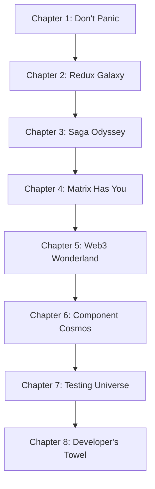

# The Hitchhiker's Guide to zOS - Chapter Plans

## Book Structure Overview

The guide follows a carefully orchestrated journey from foundational understanding to advanced implementation patterns, designed to progressively build expertise while maintaining engagement.

## Chapter 1: Don't Panic - Introduction to the zOS Universe

### Learning Objectives
- Understand the overall architecture and design philosophy of zOS
- Grasp the Redux-Saga-Normalizr trinity and why it was chosen
- Map the application structure and key directories
- Establish mental models for thinking about complex systems

### Content Outline
1. **The Big Picture** (10 minutes)
   - High-level architecture overview
   - Technology stack rationale
   - Design principles and constraints

2. **The Technology Trinity** (15 minutes)
   - Why Redux over Context API or Zustand
   - Why Saga over Thunk or RTK Query
   - Why Normalizr for entity management
   - How they work together

3. **Codebase Geography** (15 minutes)
   - Directory structure deep dive
   - Key files and their purposes
   - Navigation patterns
   - Development environment setup

4. **The Development Philosophy** (10 minutes)
   - Type safety first
   - Testing as documentation
   - Performance by design
   - Maintainability over cleverness

### Key Patterns Introduced
- Basic Redux flow with TypeScript
- Simple saga effect patterns
- Normalized entity structure
- Component-container pattern

### Workshop Exercises
- Architecture scavenger hunt
- Simple action-saga-reducer flow
- Setting up development environment

### Status: PENDING
### Dependencies: None
### Output: `/opusdocs/hitchhiker/chapters/01-dont-panic.md`

---

## Chapter 2: The Redux Galaxy - Understanding State Management at Scale

### Learning Objectives
- Master advanced Redux patterns used in production
- Understand normalized state design and benefits
- Learn selector composition and memoization
- Implement type-safe Redux with complex state shapes

### Content Outline
1. **State Architecture** (15 minutes)
   - Normalized vs denormalized state
   - Entity relationship design
   - State shape optimization
   - Performance implications

2. **Redux Toolkit Mastery** (20 minutes)
   - createSlice advanced patterns
   - createEntityAdapter usage
   - RTK Query integration points
   - Immer under the hood

3. **Selector Engineering** (15 minutes)
   - createSelector composition
   - Memoization strategies
   - Cross-slice selectors
   - Performance monitoring

4. **Type Safety** (10 minutes)
   - RootState typing
   - Action typing patterns
   - Selector type inference
   - Generic reducers

### Key Patterns Introduced
- Entity normalization with Normalizr
- Memoized selector chains
- Cross-cutting concerns in state
- Optimistic updates preparation

### Workshop Exercises
- Design normalized schema for complex data
- Build reusable selector library
- Implement type-safe slice with relationships

### Status: PENDING
### Dependencies: Chapter 1 complete
### Output: `/opusdocs/hitchhiker/chapters/02-redux-galaxy.md`

---

## Chapter 3: Saga Odyssey - Async Patterns That Will Blow Your Mind

### Learning Objectives
- Master Redux-Saga for complex async flows
- Understand saga composition and orchestration
- Implement error handling and retry patterns
- Build cancellable and raceable operations

### Content Outline
1. **Saga Fundamentals** (15 minutes)
   - Generator functions deep dive
   - Effect creators and combinators
   - Channel communication patterns
   - Testing saga flows

2. **Advanced Flow Control** (25 minutes)
   - takeEvery vs takeLatest vs takeLeading
   - Racing and cancellation
   - Fork and spawn patterns
   - Error boundaries in sagas

3. **Real-world Patterns** (20 minutes)
   - Optimistic updates with rollback
   - Background sync operations
   - Complex multi-step flows
   - Cross-saga communication

4. **Matrix Integration** (15 minutes)
   - Handling Matrix events
   - Real-time data synchronization
   - Connection management
   - Event ordering and deduplication

### Key Patterns Introduced
- Saga orchestration patterns
- Error handling with saga try/catch
- Background task management
- Event-driven architecture

### Workshop Exercises
- Build complete chat message flow
- Implement optimistic updates with rollback
- Create background sync system

### Status: PENDING
### Dependencies: Chapter 2 complete
### Output: `/opusdocs/hitchhiker/chapters/03-saga-odyssey.md`

---

## Chapter 4: The Matrix Has You - Real-time Decentralized Communication

### Learning Objectives
- Understand Matrix protocol integration
- Master real-time event handling
- Implement encryption and security patterns
- Build performant chat interfaces

### Content Outline
1. **Matrix Protocol Foundation** (15 minutes)
   - Decentralized communication principles
   - Room and event concepts
   - Federation and homeservers
   - End-to-end encryption basics

2. **Integration Architecture** (20 minutes)
   - MatrixClient wrapper patterns
   - Event processing pipeline
   - State synchronization
   - Error handling and reconnection

3. **Real-time Features** (20 minutes)
   - Message sending and receiving
   - Typing indicators
   - Read receipts and presence
   - File uploads and media

4. **Performance Optimization** (10 minutes)
   - Event batching and debouncing
   - Memory management
   - Connection pooling
   - Sliding sync implementation

### Key Patterns Introduced
- Event-driven real-time systems
- Encryption key management
- Optimistic UI for messaging
- Connection resilience patterns

### Workshop Exercises
- Build complete chat room
- Implement typing indicators
- Add file sharing with encryption

### Status: PENDING
### Dependencies: Chapter 3 complete
### Output: `/opusdocs/hitchhiker/chapters/04-matrix-has-you.md`

---

## Chapter 5: Web3 Wonderland - Blockchain Integration Without the Hype

### Learning Objectives
- Integrate Web3 functionality seamlessly
- Handle wallet connections and transactions
- Implement smart contract interactions
- Design user-friendly blockchain features

### Content Outline
1. **Web3 Architecture** (15 minutes)
   - Wagmi and RainbowKit integration
   - Wallet connection patterns
   - Network switching and validation
   - Error handling strategies

2. **Transaction Patterns** (20 minutes)
   - Token transfers and approvals
   - Smart contract interactions
   - Gas optimization techniques
   - Transaction monitoring

3. **Creator Economy Integration** (20 minutes)
   - NFT minting and trading
   - Revenue sharing contracts
   - Staking mechanisms
   - DAO governance integration

4. **User Experience Design** (10 minutes)
   - Progressive Web3 onboarding
   - Graceful degradation
   - Loading states and feedback
   - Error recovery patterns

### Key Patterns Introduced
- Multi-wallet support architecture
- Optimistic blockchain interactions
- Creator monetization patterns
- Decentralized identity management

### Workshop Exercises
- Build wallet connection flow
- Implement token staking interface
- Create NFT marketplace features

### Status: PENDING
### Dependencies: Chapter 4 complete
### Output: `/opusdocs/hitchhiker/chapters/05-web3-wonderland.md`

---

## Chapter 6: Component Cosmos - Building Blocks of the Future

### Learning Objectives
- Master advanced React patterns in zOS
- Understand component composition strategies
- Implement performance optimization techniques
- Build reusable component systems

### Content Outline
1. **Component Architecture** (15 minutes)
   - Presentation vs container components
   - Compound component patterns
   - Render props and custom hooks
   - Higher-order component usage

2. **Performance Optimization** (20 minutes)
   - React.memo and useMemo patterns
   - Virtual scrolling implementation
   - Lazy loading strategies
   - Bundle splitting and code sharing

3. **Design System Integration** (15 minutes)
   - zUI component library usage
   - Theming and customization
   - Accessibility patterns
   - Responsive design strategies

4. **Advanced Patterns** (15 minutes)
   - Error boundaries and fallbacks
   - Suspense and concurrent features
   - Portal and modal management
   - Context optimization

### Key Patterns Introduced
- Compound component composition
- Performance-optimized lists
- Accessible interactive components
- Error boundary strategies

### Workshop Exercises
- Build complex form with validation
- Implement infinite scroll component
- Create accessible modal system

### Status: PENDING
### Dependencies: Chapter 5 complete
### Output: `/opusdocs/hitchhiker/chapters/06-component-cosmos.md`

---

## Chapter 7: Testing the Universe - How to Know Your Code Actually Works

### Learning Objectives
- Master testing strategies for complex systems
- Test async flows and real-time features
- Implement effective mocking patterns
- Build comprehensive test suites

### Content Outline
1. **Testing Philosophy** (10 minutes)
   - Testing pyramid for complex apps
   - Unit vs integration vs e2e
   - Test-driven development patterns
   - Behavior-driven testing

2. **Redux and Saga Testing** (20 minutes)
   - Testing reducers and selectors
   - Saga testing patterns
   - Mocking external dependencies
   - Integration test strategies

3. **Component Testing** (15 minutes)
   - React Testing Library patterns
   - User interaction testing
   - Async component testing
   - Accessibility testing

4. **System Testing** (20 minutes)
   - Matrix integration testing
   - Web3 transaction testing
   - Performance testing
   - Error scenario testing

### Key Patterns Introduced
- Saga testing with runSaga
- Component integration tests
- Mock service patterns
- End-to-end test orchestration

### Workshop Exercises
- Test complete feature flow
- Build comprehensive test utilities
- Implement visual regression testing

### Status: PENDING
### Dependencies: Chapter 6 complete
### Output: `/opusdocs/hitchhiker/chapters/07-testing-universe.md`

---

## Chapter 8: The Developer's Towel - Essential Tools and Workflows

### Learning Objectives
- Master development workflow optimization
- Understand debugging techniques for complex systems
- Implement effective monitoring and logging
- Build deployment and maintenance strategies

### Content Outline
1. **Development Environment** (15 minutes)
   - IDE setup and extensions
   - Debugging tools and techniques
   - Development server optimization
   - Hot reload and fast refresh

2. **Code Quality Tools** (15 minutes)
   - ESLint and Prettier configuration
   - TypeScript strict mode
   - Pre-commit hooks and CI/CD
   - Code review best practices

3. **Monitoring and Observability** (20 minutes)
   - Error tracking with Sentry
   - Performance monitoring
   - User analytics integration
   - Real-time debugging tools

4. **Deployment and Maintenance** (15 minutes)
   - Build optimization strategies
   - Environment configuration
   - Feature flag management
   - Rollback and recovery procedures

### Key Patterns Introduced
- Advanced debugging workflows
- Performance profiling techniques
- Error monitoring integration
- Continuous deployment patterns

### Workshop Exercises
- Set up complete development environment
- Implement comprehensive monitoring
- Build deployment pipeline

### Status: PENDING
### Dependencies: Chapter 7 complete
### Output: `/opusdocs/hitchhiker/chapters/08-developers-towel.md`

---

## Cross-Chapter Integration Points

### Recurring Themes
1. **Type Safety**: Every chapter reinforces TypeScript best practices
2. **Performance**: Consistent focus on optimization techniques
3. **Testing**: Each pattern includes testing strategies
4. **Accessibility**: User experience considerations throughout
5. **Maintainability**: Code organization and documentation

### Knowledge Dependencies
- Each chapter builds on previous concepts
- Cross-references guide readers to related topics
- "Deep Dive" sections provide advanced exploration
- "Quick Reference" summaries for easy lookup

### Workshop Progression
- Exercises build toward complete feature implementation
- Final project integrates all learned patterns
- Difficulty progression from basic to advanced
- Real-world scenarios and edge cases

---

## Agent Coordination Notes

### Chapter Dependencies

### Production Schedule
- **Phase 1**: Chapters 1-2 (Foundation)
- **Phase 2**: Chapters 3-4 (Core Patterns)
- **Phase 3**: Chapters 5-6 (Advanced Features)
- **Phase 4**: Chapters 7-8 (Quality & Workflow)

### Quality Gates
- Technical accuracy review after each chapter
- Narrative consistency check across chapters
- Workshop exercise validation
- Cross-reference verification

---

*This chapter plan serves as the master blueprint for The Hitchhiker's Guide to zOS. Each agent should refer to this document when working on their respective contributions to ensure consistency and proper progression.*