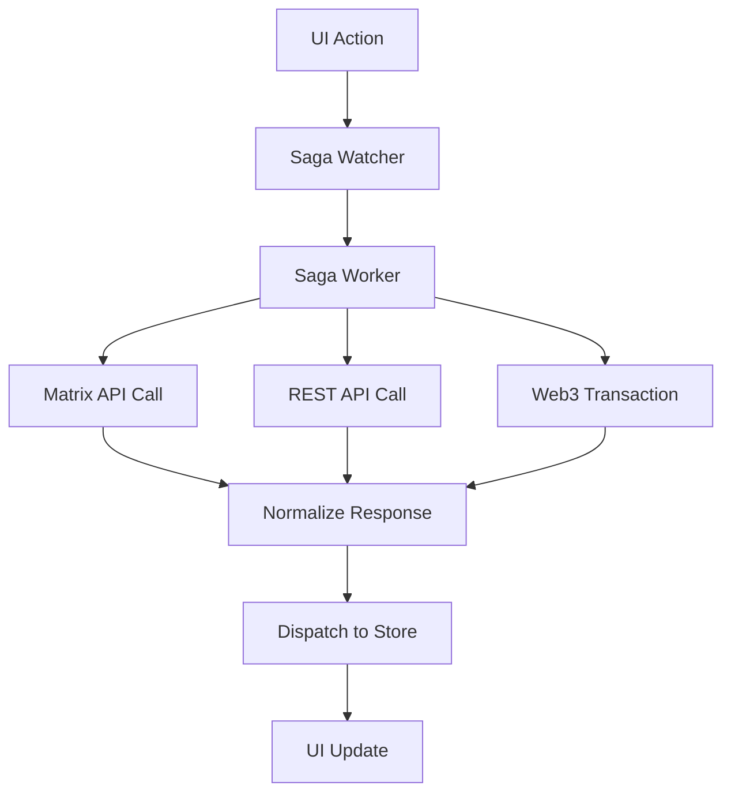

# zOS Architecture Overview

## System Overview

zOS (Zero Operating System) is a sophisticated web application built around a **Redux-Saga-Normalizr** pattern that creates a decentralized, Matrix-protocol-based social platform with Web3 integration. The architecture prioritizes real-time communication, normalized data management, and modular application design.

### High-Level Architecture

```
┌─────────────────────────────────────────────────────────────────┐
│                         zOS Application                         │
├─────────────────────────────────────────────────────────────────┤
│  ┌─────────────┐ ┌─────────────┐ ┌─────────────┐ ┌─────────────┐│
│  │   Feed      │ │ Messenger   │ │   Wallet    │ │   Staking   ││
│  │    App      │ │     App     │ │     App     │ │     App     ││
│  └─────────────┘ └─────────────┘ └─────────────┘ └─────────────┘│
├─────────────────────────────────────────────────────────────────┤
│                      App Router                                 │
├─────────────────────────────────────────────────────────────────┤
│  ┌─────────────┐ ┌─────────────┐ ┌─────────────┐ ┌─────────────┐│
│  │   Redux     │ │   Sagas     │ │ Normalized  │ │   Matrix    ││
│  │   Store     │ │ Middleware  │ │   State     │ │   Client    ││
│  └─────────────┘ └─────────────┘ └─────────────┘ └─────────────┘│
├─────────────────────────────────────────────────────────────────┤
│  ┌─────────────┐ ┌─────────────┐ ┌─────────────┐ ┌─────────────┐│
│  │   Matrix    │ │    Web3     │ │  Cloudinary │ │   Thirdweb  ││
│  │  Protocol   │ │  Wallets    │ │   Images    │ │    APIs     ││
│  └─────────────┘ └─────────────┘ └─────────────┘ └─────────────┘│
└─────────────────────────────────────────────────────────────────┘
```

### Core Technology Stack

- **Frontend Framework**: React 18 with TypeScript
- **State Management**: Redux Toolkit + Redux-Saga
- **Data Normalization**: Normalizr for entity management
- **Real-time Communication**: Matrix Protocol (matrix-js-sdk)
- **Web3 Integration**: Wagmi + RainbowKit + Thirdweb
- **Styling**: SCSS with CSS Modules
- **Build Tool**: Vite
- **Testing**: Vitest + Jest

## Main Architectural Patterns

### 1. Redux-Saga-Normalizr Pattern

The application follows a sophisticated state management pattern that combines:

- **Redux Toolkit**: Modern Redux with createSlice for reducers
- **Redux-Saga**: Side effect management for async operations
- **Normalizr**: Entity normalization for relational data

#### Why This Pattern?

- **Redux-Saga over alternatives**: Provides powerful async flow control with cancellation, racing, and complex orchestration
- **Normalized state benefits**: Eliminates data duplication, ensures consistency, and simplifies updates
- **Matrix protocol integration**: Sagas handle complex Matrix event flows and real-time synchronization

### 2. Modular Application Architecture

Each major feature is organized as a self-contained "app" within the `/src/apps/` directory:

```
apps/
├── feed/           # Social media feed functionality
├── messenger/      # Real-time chat application
├── wallet/         # Web3 wallet management
├── staking/        # DeFi staking interface
├── profile/        # User profile management
├── notifications/  # Notification system
└── explorer/       # External app integration
```

## Data Flow Architecture

### Redux Store Structure

```
rootState: {
  // Core entities (normalized)
  normalized: {
    users: { [id]: User },
    channels: { [id]: Channel },
    messages: { [id]: Message }
  },
  
  // Feature slices
  authentication: AuthState,
  chat: ChatState,
  web3: Web3State,
  posts: PostsState,
  
  // UI state
  panels: PanelsState,
  dialogs: DialogsState,
  background: BackgroundState
}
```

### Saga Flow Pattern



### Normalizr Entity Management

The application uses Normalizr to manage relational data:

```typescript
// Schema definitions
const userSchema = new schema.Entity('users');
const channelSchema = new schema.Entity('channels');
const messageSchema = new schema.Entity('messages', {
  sender: userSchema,
  channel: channelSchema
});

// Normalization happens in sagas
const normalizedData = normalize(apiResponse, [messageSchema]);
dispatch(receive(normalizedData.entities));
```

## Matrix Protocol Integration

### Architecture Overview

zOS is built on the Matrix protocol for decentralized communication:

```
┌─────────────────┐    ┌──────────────────┐    ┌─────────────────┐
│   zOS Client    │◄──►│  Matrix Client   │◄──►│ Matrix Server   │
│                 │    │   (matrix-js-sdk)│    │  (Homeserver)   │
└─────────────────┘    └──────────────────┘    └─────────────────┘
         │                       │                       │
         │                       │                       │
    ┌────▼────┐             ┌────▼────┐             ┌────▼────┐
    │ Redux   │             │ Event   │             │ Room    │
    │ Sagas   │             │Handler  │             │ State   │
    └─────────┘             └─────────┘             └─────────┘
```

### Key Matrix Integration Points

1. **Authentication**: JWT-based login with Matrix homeserver
2. **Real-time Events**: Matrix events flow through sagas to Redux store
3. **End-to-End Encryption**: Built-in E2EE with key backup/restore
4. **Room Management**: Channels are Matrix rooms with custom metadata
5. **File Uploads**: Encrypted file handling through Matrix media API

### Matrix Client Wrapper

The `MatrixClient` class (`/src/lib/chat/matrix-client.ts`) provides:

- Connection management and authentication
- Event processing and normalization
- Message sending/receiving with encryption
- Room creation and management
- File upload/download with caching

## Module Architecture

### App Module Structure

Each app follows a consistent structure:

```
apps/[app-name]/
├── index.tsx                 # Main app component
├── components/              # App-specific components
├── lib/                     # Business logic and hooks
│   ├── types.ts            # TypeScript interfaces
│   ├── useAppLogic.ts      # Custom hooks
│   └── utils.ts            # Utility functions
└── styles.module.scss      # Scoped styles
```

### Component Hierarchy

```
App
├── AppRouter               # Route-based app switching
│   ├── MessengerApp       # Real-time chat
│   ├── FeedApp            # Social media feed
│   ├── WalletApp          # Web3 wallet
│   └── [Other Apps]
├── AppBar                 # Global navigation
├── DialogManager          # Modal management
└── Sidekick              # Context-aware sidebar
```

### State Management Per Feature

Each feature manages its state through:

1. **Slice**: Redux slice with actions and reducers
2. **Saga**: Side effect management and async operations
3. **Selectors**: Memoized state access patterns
4. **Hooks**: React hooks for component integration

Example pattern:
```typescript
// Slice (actions + reducer)
const slice = createSlice({
  name: 'feature',
  initialState,
  reducers: { /* sync actions */ }
});

// Saga (async operations)
function* featureSaga() {
  yield takeEvery('feature/action', handleAction);
}

// Selectors (memoized state access)
const selectFeatureData = createSelector(
  (state) => state.feature,
  (feature) => feature.data
);
```

## Web3 Architecture

### Integration Strategy

zOS integrates Web3 functionality through multiple layers:

1. **Wagmi**: React hooks for Ethereum interaction
2. **RainbowKit**: Wallet connection UI
3. **Thirdweb**: Additional Web3 utilities and APIs
4. **Custom Hooks**: App-specific Web3 logic

### Web3 State Management

```typescript
interface Web3State {
  status: ConnectionStatus;
  value: {
    chainId: number;
    address: string;
    connectorId: string;
    error: string;
  };
}
```

### Wallet Integration Points

- **Authentication**: Web3 login alongside Matrix authentication
- **Staking**: DeFi protocol interactions
- **NFT Management**: Token display and transfers
- **Transaction History**: On-chain activity tracking

## Essential Concepts for Developers

### 1. Why Redux-Saga?

**Advantages:**
- **Testability**: Sagas are pure functions, easy to test
- **Cancellation**: Built-in support for cancelling async operations
- **Flow Control**: Complex async orchestration with racing, forking
- **Integration**: Perfect for handling Matrix protocol events

**Common Pattern:**
```typescript
function* handleMessageSend(action) {
  try {
    // Send via Matrix
    const result = yield call(matrixClient.sendMessage, action.payload);
    
    // Update optimistic message
    yield put(updateOptimisticMessage(result));
    
    // Record analytics
    yield fork(recordMessageSent, result);
  } catch (error) {
    yield put(setError(error));
  }
}
```

### 2. Normalized State Benefits

**Problem Solved:**
- Data duplication across components
- Inconsistent updates
- Complex nested state updates

**Solution:**
```typescript
// Instead of nested data
{
  channels: [
    { id: 1, name: "General", messages: [/* full message objects */] }
  ]
}

// Use normalized structure
{
  channels: { 1: { id: 1, name: "General", messageIds: [101, 102] } },
  messages: { 
    101: { id: 101, text: "Hello", senderId: 5 },
    102: { id: 102, text: "World", senderId: 3 }
  },
  users: {
    3: { id: 3, name: "Alice" },
    5: { id: 5, name: "Bob" }
  }
}
```

### 3. Matrix Protocol Benefits

**Decentralization**: No single point of failure
**Interoperability**: Standards-based communication
**Security**: End-to-end encryption by default
**Scalability**: Federation across multiple servers

### 4. Component Integration Patterns

**Using Selectors:**
```typescript
const MyComponent = () => {
  const messages = useSelector(selectChannelMessages(channelId));
  const users = useSelector(selectUsers);
  
  return (
    <div>
      {messages.map(message => (
        <Message 
          key={message.id} 
          message={message}
          user={users[message.senderId]}
        />
      ))}
    </div>
  );
};
```

**Dispatching Actions:**
```typescript
const dispatch = useDispatch();

const handleSendMessage = (text: string) => {
  dispatch(sendMessage({ 
    channelId, 
    text, 
    optimisticId: generateId() 
  }));
};
```

## Common Pitfalls and Solutions

### 1. **Async State Race Conditions**
**Problem**: Multiple async operations updating the same state
**Solution**: Use saga patterns like `takeLatest` or request cancellation

### 2. **Normalized State Complexity**
**Problem**: Difficulty accessing related entities
**Solution**: Use memoized selectors to join normalized data

### 3. **Matrix Event Ordering**
**Problem**: Out-of-order event processing
**Solution**: Event sequencing in sagas with proper error handling

### 4. **Memory Leaks in Real-time Apps**
**Problem**: Event listeners not cleaned up
**Solution**: Proper cleanup in useEffect hooks and saga cancellation

## Getting Started: Developer Mental Model

### 1. **Data Flow Understanding**
1. User interacts with UI component
2. Component dispatches Redux action
3. Saga intercepts action and handles side effects
4. API responses are normalized and stored
5. Selectors provide normalized data to components
6. UI updates reactively

### 2. **Adding New Features**
1. Define normalized schema if needed
2. Create Redux slice with actions
3. Implement saga for async operations
4. Create selectors for data access
5. Build UI components with hooks
6. Connect everything through the app router

### 3. **Matrix Integration**
1. Understand rooms as channels
2. Events flow through the MatrixClient wrapper
3. Sagas process Matrix events into Redux actions
4. UI components react to normalized state changes

### 4. **Web3 Integration**
1. Use Wagmi hooks for blockchain interactions
2. Handle wallet connection state
3. Integrate with existing Redux patterns
4. Consider gas optimization and error handling

---

This architecture enables zOS to be a scalable, real-time, decentralized social platform that seamlessly integrates Web3 functionality while maintaining a clean separation of concerns and robust state management.