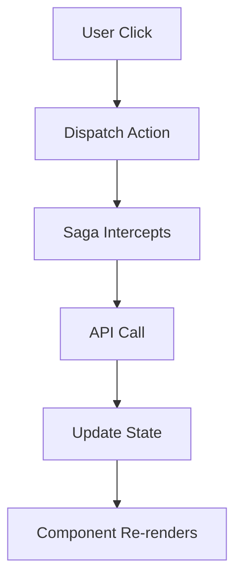

# The Hitchhiker's Guide to zOS - Visual Diagrams

*"A picture is worth a thousand words. A good diagram is worth a thousand debugging sessions."*

This directory contains visual explanations for complex zOS concepts. Because sometimes the best way to understand how something works is to see it in action.

## Diagram Categories

### 🏗️ System Architecture
High-level views of how zOS components fit together.

- **[Overall System Architecture](./architecture/system-overview.md)** - The big picture
- **[Application Structure](./architecture/app-structure.md)** - How apps are organized
- **[Data Flow Overview](./architecture/data-flow.md)** - Information flow through the system
- **[Technology Stack](./architecture/tech-stack.md)** - How technologies integrate

### 🔄 Redux and State Management
Visual representations of state management patterns.

- **[Redux Galaxy Visuals](./redux-galaxy-visuals.md)** - Complete Redux-Saga flow, normalization patterns, and state architecture from Chapter 2
- **[Normalization Patterns](./normalization-patterns.md)** - Detailed ASCII art visualizations of normalization engine and merge-first strategies
- **[Redux Store Structure](./redux/store-structure.md)** - State tree organization
- **[Normalized Entities](./redux/normalized-entities.md)** - Entity relationship diagrams
- **[Action Flow](./redux/action-flow.md)** - How actions flow through the system
- **[Selector Composition](./redux/selector-composition.md)** - Building complex selectors

### ⚡ Redux-Saga Flows
Async operation orchestration and side effect management.

- **[Redux-Saga Flows](./redux-saga-flows.md)** - Detailed Mermaid diagrams for authentication, messaging, real-time events, and error handling flows
- **[Basic Saga Flow](./saga/basic-flow.md)** - Simple async operations
- **[Complex Orchestration](./saga/complex-orchestration.md)** - Multi-step workflows
- **[Error Handling](./saga/error-handling.md)** - Robust error management
- **[Cancellation Patterns](./saga/cancellation.md)** - Cleaning up operations

### 🌐 Matrix Protocol Integration
Real-time communication and event processing.

- **[Matrix Event Flow](./matrix/event-flow.md)** - How Matrix events are processed
- **[Room State Management](./matrix/room-state.md)** - Room data synchronization
- **[Encryption Pipeline](./matrix/encryption.md)** - E2E encryption handling
- **[Connection Management](./matrix/connection.md)** - Network resilience

### 🔗 Web3 Integration
Blockchain integration patterns and transaction flows.

- **[Wallet Connection Flow](./web3/wallet-connection.md)** - Multi-wallet support
- **[Transaction Pipeline](./web3/transaction-flow.md)** - Safe transaction handling
- **[Smart Contract Integration](./web3/contract-integration.md)** - Contract interaction patterns
- **[Error Recovery](./web3/error-recovery.md)** - Blockchain error handling

### 🧩 Component Architecture
React component organization and interaction patterns.

- **[Component Hierarchy](./components/hierarchy.md)** - UI component relationships
- **[Data Flow in Components](./components/data-flow.md)** - Props and state management
- **[Event Handling](./components/event-handling.md)** - User interaction patterns
- **[Performance Optimization](./components/performance.md)** - Rendering optimizations

### 🚀 Performance and Optimization
Visual guides to performance improvement strategies.

- **[Bundle Structure](./performance/bundle-structure.md)** - Code splitting visualization
- **[Rendering Pipeline](./performance/rendering-pipeline.md)** - React rendering process
- **[Memory Management](./performance/memory-management.md)** - Preventing memory leaks
- **[Network Optimization](./performance/network-optimization.md)** - API and asset loading

## Diagram Formats

### ASCII Art Diagrams
Terminal-friendly diagrams that work in any environment.

```
┌─────────────────┐    ┌──────────────────┐    ┌─────────────────┐
│   User Action   │───▶│   Redux Action   │───▶│   Saga Worker   │
└─────────────────┘    └──────────────────┘    └─────────────────┘
                                                         │
                                                         ▼
┌─────────────────┐    ┌──────────────────┐    ┌─────────────────┐
│   UI Update     │◀───│   State Update   │◀───│   API Response  │
└─────────────────┘    └──────────────────┘    └─────────────────┘
```

### Mermaid Diagrams
Rich, interactive diagrams for web viewing.



### Custom Visualizations
Specialized diagrams for complex concepts.

## Diagram Standards

### Visual Consistency
- **Colors**: Consistent color scheme across diagrams
- **Shapes**: Standard shapes for common concepts
- **Arrows**: Clear directional flow indicators
- **Labels**: Descriptive, concise labeling

### Common Elements
- **🔵 User Actions**: Blue circles for user-initiated events
- **🟢 System Processes**: Green rectangles for automated processes
- **🟡 External Services**: Yellow diamonds for third-party integrations
- **🔴 Error States**: Red for error conditions and handling

### Accessibility
- **High Contrast**: Readable in different lighting conditions
- **Text Alternatives**: Alt text for all visual elements
- **Screen Reader Friendly**: Structured markup for assistive technology
- **Print Friendly**: Black and white versions available

## Interactive Diagrams

### Live System Visualization
Some diagrams include interactive elements to help understand dynamic behavior:

- **[Live Redux DevTools](./interactive/redux-devtools.md)** - See state changes in real-time
- **[Matrix Event Inspector](./interactive/matrix-events.md)** - Watch Matrix events flow
- **[Saga Flow Debugger](./interactive/saga-debugger.md)** - Step through saga execution
- **[Component Update Tracer](./interactive/component-tracer.md)** - Trace React re-renders

### Simulation Tools
Educational tools that let you experiment with concepts:

- **[State Management Simulator](./simulations/state-management.md)** - Experiment with different patterns
- **[Async Flow Designer](./simulations/async-flow.md)** - Design and test saga flows
- **[Performance Profiler](./simulations/performance.md)** - Visualize performance impact

## Diagram Usage Guidelines

### When to Use Diagrams
- **Complex Relationships**: When text descriptions become unwieldy
- **Process Flows**: Multi-step operations with decision points
- **System Architecture**: Overall structure and component relationships
- **Debugging**: Visual debugging aids for complex issues

### Creating New Diagrams
1. **Identify Need**: Clear educational or documentation purpose
2. **Choose Format**: ASCII for simplicity, Mermaid for interactivity
3. **Follow Standards**: Use consistent visual language
4. **Test Clarity**: Ensure diagrams are self-explanatory
5. **Get Review**: Validate accuracy with subject matter experts

### Maintaining Diagrams
- **Keep Updated**: Reflect current system state
- **Version Control**: Track changes over time
- **Cross-Reference**: Link to related documentation
- **Regular Review**: Periodic accuracy validation

## Common Diagram Patterns

### Data Flow Diagrams
```
Input ──▶ Process ──▶ Output
  │         │          │
  ▼         ▼          ▼
Error ──▶ Handle ──▶ Recovery
```

### State Machines
```
[Initial] ──event──▶ [Processing] ──success──▶ [Complete]
    │                      │
    │                      │
    └──────error───────────┴──▶ [Error] ──retry──▶ [Processing]
```

### Component Trees
```
App
├── Router
│   ├── MessengerApp
│   │   ├── ChannelList
│   │   └── MessageArea
│   └── WalletApp
│       ├── AssetList
│       └── TransactionHistory
└── AppBar
    ├── UserMenu
    └── Navigation
```

### Sequence Diagrams
```
User    Component    Saga    API    State
 │         │         │       │       │
 │ click   │         │       │       │
 ├────────▶│         │       │       │
 │         │ action  │       │       │
 │         ├────────▶│       │       │
 │         │         │ call  │       │
 │         │         ├──────▶│       │
 │         │         │       │ data  │
 │         │         │◀──────┤       │
 │         │         │ put   │       │
 │         │         ├──────────────▶│
 │         │ update  │       │       │
 │         │◀──────────────────────────┤
 │ render  │         │       │       │
 │◀────────┤         │       │       │
```

## Diagram Index

### By Complexity Level

#### 🟢 Beginner (Simple Concepts)
- Basic Redux flow
- Simple component hierarchy
- Linear process flows

#### 🟡 Intermediate (Multi-step Processes)
- Saga orchestration
- Matrix event processing
- Component interaction

#### 🟠 Advanced (Complex Systems)
- Full system architecture
- Performance optimization flows
- Error handling strategies

#### 🔴 Expert (Architectural Patterns)
- Distributed system patterns
- Advanced optimization techniques
- System design trade-offs

### By Use Case

#### **Learning** 
- Educational progression diagrams
- Concept introduction visuals
- Step-by-step process guides

#### **Reference**
- Quick lookup diagrams
- API flow charts
- Troubleshooting flowcharts

#### **Debugging**
- System state visualizations
- Error flow diagrams
- Performance bottleneck identification

#### **Architecture Planning**
- System design blueprints
- Integration patterns
- Scalability considerations

## Tools and Software

### Diagram Creation
- **ASCII Art**: Text-based diagrams for universal compatibility
- **Mermaid**: Code-based diagrams with interactive features
- **Excalidraw**: Hand-drawn style diagrams for informal explanations
- **Graphviz**: Automated layout for complex node graphs

### Integration
- **GitHub**: Mermaid diagrams render natively
- **Documentation**: Embedded in markdown files
- **Presentations**: Export formats for talks and training
- **Interactive**: Web-based explorable diagrams

---

*"The universe is not only stranger than we imagine, it is stranger than we can imagine." - J.B.S. Haldane*

*"Code is not only more complex than we imagine, it is more complex than we can imagine without good diagrams." - The Editors*

---

## Contributing to Diagrams

### Diagram Requests
Submit requests for new diagrams by:
1. Identifying the concept that needs visualization
2. Describing the target audience and use case
3. Suggesting the appropriate diagram type
4. Providing any existing reference materials

### Quality Standards
- **Accuracy**: Diagrams must reflect actual system behavior
- **Clarity**: Self-explanatory without extensive external context  
- **Consistency**: Follow established visual standards
- **Maintainability**: Easy to update as system evolves

### Review Process
1. **Technical Review**: Validate accuracy with code experts
2. **Educational Review**: Test clarity with target audience
3. **Accessibility Review**: Ensure inclusive design
4. **Integration Review**: Confirm proper linking and context

## Quick Navigation

- **[Main Guide](../chapters/)** - Full educational content
- **[Pattern Library](../patterns/)** - Implementation patterns
- **[Workshops](../workshops/)** - Hands-on exercises
- **[Quick Reference](../reference/)** - Fast lookup resources

---

*Remember: A good diagram doesn't just show what the system does - it shows why it does it that way.*