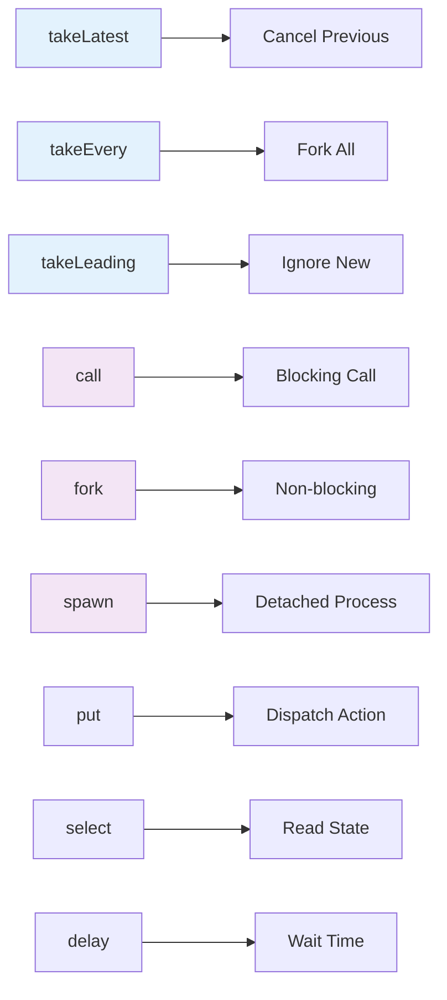

# Redux-Saga Flow Diagrams

*"Every great saga has a beginning, middle, and end. These flows just happen to have generators, effects, and state updates."*

This document provides detailed Mermaid diagrams for the most important Redux-Saga flows in zOS, making complex async patterns visually clear and debuggable.

---

## Core Saga Patterns

### 1. Authentication Flow

```mermaid
graph TD
    A[User Login Attempt] --> B[dispatch(login.request)]
    B --> C[Login Saga Watcher]
    C --> D{takeLatest}
    D --> E[Cancel Previous Login]
    E --> F[Execute Login Worker]
    
    F --> G[call(validateCredentials)]
    G --> H{Credentials Valid?}
    
    H -->|Yes| I[call(fetchUserProfile)]
    H -->|No| J[put(login.failure)]
    
    I --> K{Profile Fetch Success?}
    K -->|Yes| L[Normalize User Data]
    K -->|No| M[put(login.failure)]
    
    L --> N[put(normalized.receive)]
    N --> O[put(login.success)]
    O --> P[call(redirectToApp)]
    
    J --> Q[Update Error State]
    M --> Q
    Q --> R[Show Error Message]
    
    P --> S[User Authenticated]
    
    style A fill:#e3f2fd
    style F fill:#f3e5f5
    style L fill:#e8f5e8
    style J fill:#ffebee
    style M fill:#ffebee
```

### 2. Message Send with Optimistic Updates

```mermaid
graph TD
    A[User Sends Message] --> B[dispatch(sendMessage)]
    B --> C[Message Saga Watcher]
    C --> D{takeEvery}
    D --> E[Create Optimistic Entity]
    
    E --> F[Generate Temp ID]
    F --> G[put(receiveOptimisticMessage)]
    G --> H[UI Shows Pending]
    
    E --> I[call(sendMessageAPI)]
    I --> J{API Success?}
    
    J -->|Yes| K[Extract Real Message Data]
    J -->|No| L[call(removeOptimisticMessage)]
    
    K --> M[Normalize Response]
    M --> N[put(normalized.receive)]
    N --> O[Map Optimistic to Real ID]
    O --> P[Update Message References]
    
    L --> Q[put(showErrorNotification)]
    Q --> R[Restore Previous State]
    
    P --> S[UI Shows Sent Message]
    R --> T[UI Shows Error State]
    
    style E fill:#fff3e0
    style G fill:#fff3e0
    style L fill:#ffebee
    style Q fill:#ffebee
```

### 3. Real-time Event Processing

```mermaid
graph TD
    A[Matrix Event Received] --> B[Event Router Saga]
    B --> C{Event Type}
    
    C -->|m.room.message| D[Message Event Handler]
    C -->|m.room.member| E[Member Event Handler]
    C -->|m.presence| F[Presence Event Handler]
    C -->|m.typing| G[Typing Event Handler]
    
    D --> H[Extract Message Data]
    H --> I[call(mapMessageSenders)]
    I --> J[Normalize Message]
    J --> K[Batch Event Processing]
    
    E --> L[Extract Member Data]
    L --> M[Update Channel Members]
    M --> K
    
    F --> N[Extract Presence Data]
    N --> O[Update User Status]
    O --> K
    
    G --> P[Extract Typing Data]
    P --> Q[Update Typing Indicators]
    Q --> K
    
    K --> R[delay(BATCH_INTERVAL)]
    R --> S[put(normalized.receive)]
    S --> T[Components Re-render]
    
    style A fill:#e1f5fe
    style K fill:#f3e5f5
    style R fill:#fff3e0
    style S fill:#e8f5e8
```

---

## Advanced Flow Patterns

### 4. Channel Creation with Encryption

```mermaid
graph TD
    A[Create Channel Request] --> B[Channel Creation Saga]
    B --> C[select(currentUser)]
    C --> D[Validate Permissions]
    
    D --> E{Encryption Required?}
    E -->|Yes| F[Generate Room Keys]
    E -->|No| G[call(createPlainChannel)]
    
    F --> H[call(createEncryptedChannel)]
    H --> I{Channel Created?}
    G --> I
    
    I -->|Yes| J[Normalize Channel Data]
    I -->|No| K[put(createChannel.failure)]
    
    J --> L[Add Creator as Admin]
    L --> M[Setup Default Permissions]
    M --> N[put(normalized.receive)]
    
    N --> O{Invite Members?}
    O -->|Yes| P[call(inviteMembers)]
    O -->|No| Q[put(createChannel.success)]
    
    P --> R[Send Invitations]
    R --> Q
    
    K --> S[Show Error Message]
    Q --> T[Navigate to Channel]
    
    style F fill:#f3e5f5
    style H fill:#f3e5f5
    style K fill:#ffebee
    style P fill:#e8f5e8
```

### 5. File Upload with Progress

```mermaid
graph TD
    A[User Selects File] --> B[dispatch(uploadFile)]
    B --> C[File Upload Saga]
    C --> D[Validate File]
    
    D --> E{File Valid?}
    E -->|No| F[put(uploadFile.failure)]
    E -->|Yes| G[Create Upload Progress Tracker]
    
    G --> H[Create Uploadable Instance]
    H --> I[call(uploadToS3)]
    
    I --> J[Monitor Upload Progress]
    J --> K[put(updateUploadProgress)]
    K --> L{Upload Complete?}
    
    L -->|No| J
    L -->|Yes| M[Extract File Metadata]
    
    M --> N[Create Message with File]
    N --> O[dispatch(sendMessage)]
    O --> P[Link to Message Saga]
    
    F --> Q[Show Upload Error]
    P --> R[Message Sent with File]
    
    style D fill:#fff3e0
    style G fill:#e8f5e8
    style J fill:#f3e5f5
    style F fill:#ffebee
```

---

## Error Handling Flows

### 6. Network Retry Logic

```mermaid
graph TD
    A[API Call Fails] --> B[Extract Error Info]
    B --> C{Error Type}
    
    C -->|Network| D[Network Retry Flow]
    C -->|Auth| E[Authentication Flow]
    C -->|Rate Limit| F[Rate Limit Flow]
    C -->|Server Error| G[Server Error Flow]
    
    D --> H[Increment Retry Count]
    H --> I{Retry Count < MAX}
    I -->|Yes| J[Exponential Backoff]
    I -->|No| K[put(networkError)]
    
    J --> L[delay(backoffMs)]
    L --> M[Retry Original Call]
    M --> N{Success?}
    N -->|Yes| O[Continue Normal Flow]
    N -->|No| H
    
    E --> P[Clear Auth Tokens]
    P --> Q[put(logout)]
    Q --> R[Redirect to Login]
    
    F --> S[Extract Retry-After Header]
    S --> T[delay(retryAfterMs)]
    T --> U[Retry Original Call]
    
    G --> V{Error Code}
    V -->|500-502| W[Show Retry Dialog]
    V -->|503| X[Show Maintenance Message]
    V -->|Other| Y[Show Generic Error]
    
    K --> Z[Show Network Error]
    O --> AA[Success State]
    
    style D fill:#fff3e0
    style E fill:#ffebee
    style F fill:#f3e5f5
    style G fill:#ffebee
    style K fill:#ffebee
```

### 7. Optimistic Update Rollback

```mermaid
graph TD
    A[Optimistic Action] --> B[Store Rollback Info]
    B --> C[Apply Optimistic State]
    C --> D[call(apiFunction)]
    
    D --> E{API Success?}
    E -->|Yes| F[Merge Real Data]
    E -->|No| G[Extract Rollback Info]
    
    F --> H[Update ID Mappings]
    H --> I[Clear Optimistic Flags]
    I --> J[put(operationSuccess)]
    
    G --> K[Remove Optimistic Entities]
    K --> L[Restore Previous State]
    L --> M[put(operationFailure)]
    
    M --> N[Show User Feedback]
    N --> O{Retryable?}
    O -->|Yes| P[Show Retry Option]
    O -->|No| Q[Show Error Message]
    
    J --> R[Success State]
    P --> S[User Can Retry]
    Q --> T[Error State]
    
    style C fill:#fff3e0
    style G fill:#f3e5f5
    style K fill:#ffebee
    style L fill:#ffebee
```

---

## Saga Orchestration Patterns

### 8. Multi-Step Workflow

```mermaid
graph TD
    A[Complex Workflow Start] --> B[Step 1: Validate Input]
    B --> C{Valid?}
    C -->|No| D[put(workflowError)]
    C -->|Yes| E[Step 2: Fetch Dependencies]
    
    E --> F[call(fetchUserData)]
    F --> G[call(fetchChannelData)]
    G --> H[call(fetchPermissions)]
    
    H --> I[Step 3: Process Data]
    I --> J[Normalize All Data]
    J --> K[Validate Relationships]
    
    K --> L{Data Consistent?}
    L -->|No| M[put(dataInconsistency)]
    L -->|Yes| N[Step 4: Apply Changes]
    
    N --> O[call(updateServer)]
    O --> P{Server Success?}
    P -->|No| Q[Rollback Changes]
    P -->|Yes| R[Step 5: Finalize]
    
    R --> S[Update Local State]
    S --> T[Notify Components]
    T --> U[put(workflowSuccess)]
    
    Q --> V[Restore Previous State]
    V --> W[put(workflowFailure)]
    
    D --> X[Error State]
    M --> X
    W --> X
    U --> Y[Success State]
    
    style B fill:#e3f2fd
    style I fill:#f3e5f5
    style N fill:#e8f5e8
    style Q fill:#ffebee
    style X fill:#ffebee
```

### 9. Concurrent Operations Management

```mermaid
graph TD
    A[Multiple Operations Triggered] --> B[Operation Coordinator]
    B --> C[fork(operation1)]
    B --> D[fork(operation2)]
    B --> E[fork(operation3)]
    
    C --> F[API Call 1]
    D --> G[API Call 2]
    E --> H[API Call 3]
    
    F --> I[Success 1]
    G --> J[Success 2]
    H --> K[Success 3]
    
    F --> L[Error 1]
    G --> M[Error 2]
    H --> N[Error 3]
    
    I --> O[Result Aggregator]
    J --> O
    K --> O
    
    L --> P[Error Handler]
    M --> P
    N --> P
    
    O --> Q{All Successful?}
    Q -->|Yes| R[Merge All Results]
    Q -->|No| S[Partial Success Handler]
    
    P --> T{Critical Error?}
    T -->|Yes| U[Cancel All Operations]
    T -->|No| V[Continue with Others]
    
    R --> W[put(allOperationsSuccess)]
    S --> X[put(partialSuccess)]
    U --> Y[put(operationsCancelled)]
    
    style B fill:#f3e5f5
    style O fill:#e8f5e8
    style P fill:#fff3e0
    style U fill:#ffebee
```

---

## Performance Optimization Flows

### 10. Batched State Updates

```mermaid
graph TD
    A[High-Frequency Events] --> B[Event Buffer]
    B --> C[Accumulate Events]
    C --> D{Buffer Full OR Timeout?}
    
    D -->|No| C
    D -->|Yes| E[Process Batch]
    
    E --> F[Group by Entity Type]
    F --> G[Merge Duplicate Updates]
    G --> H[Normalize Batch]
    
    H --> I[Single State Update]
    I --> J[put(normalized.receive)]
    J --> K[Components Re-render Once]
    
    style B fill:#f3e5f5
    style E fill:#e8f5e8
    style I fill:#e8f5e8
    style K fill:#e8f5e8
```

---

## Quick Reference: Saga Effect Patterns

### Common Effect Combinations



---

*"In the Redux Galaxy, every saga tells a story. These diagrams help you read that story, debug its plot twists, and write sequels that don't crash the universe."*

---

**Related**: [Redux Galaxy Visuals](./redux-galaxy-visuals.md) | [Chapter 2: Redux Galaxy](../chapters/02-redux-galaxy.md)