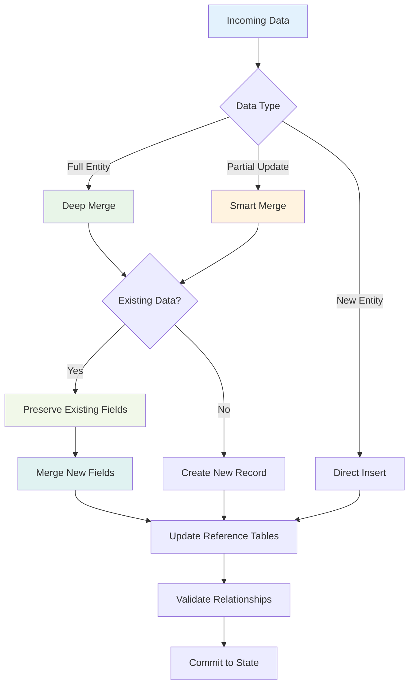
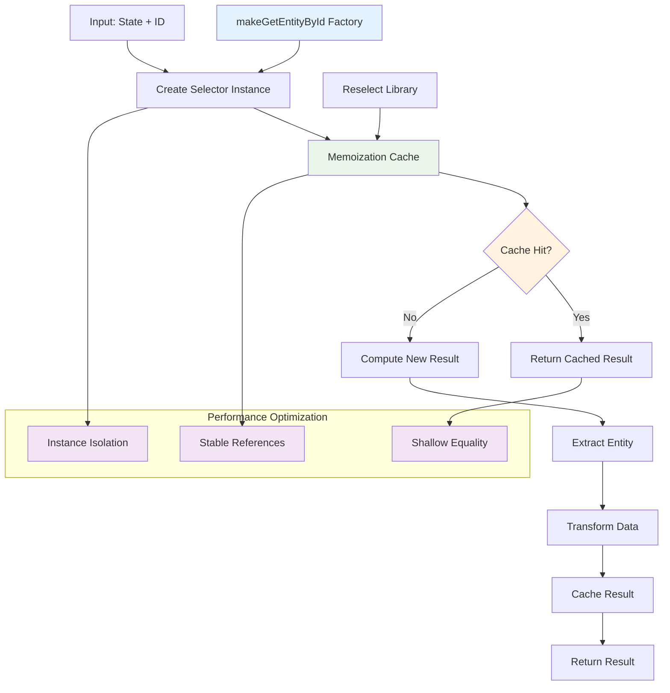
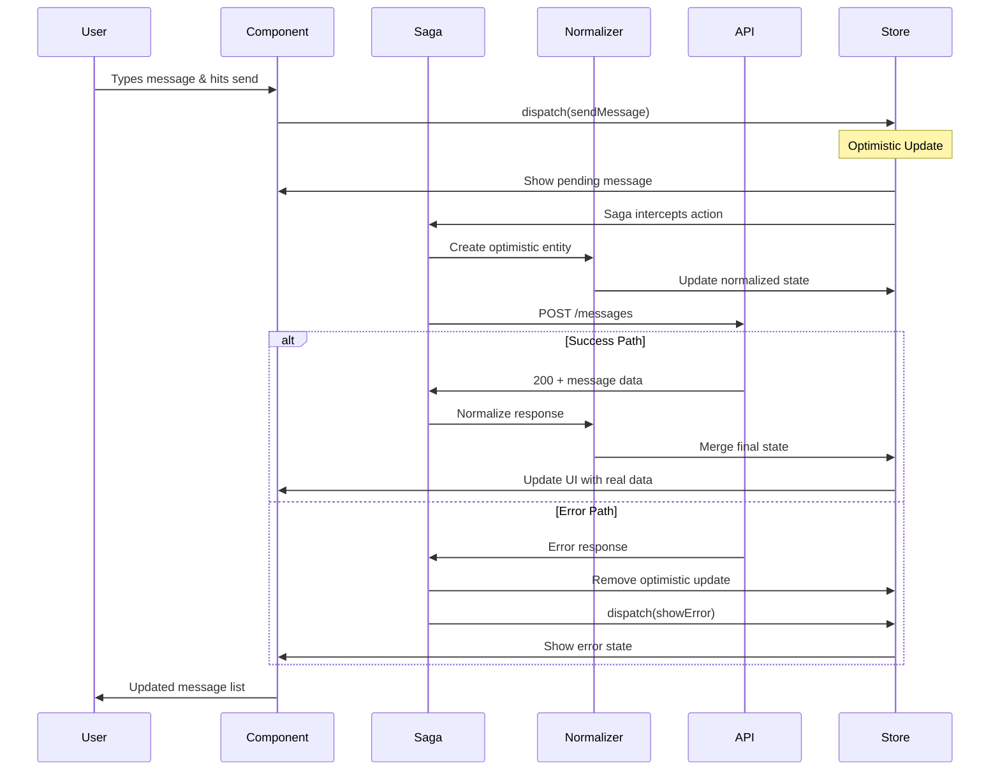

# Chapter 2: The Redux Galaxy - Understanding State Management at Scale
*An Integrated Guide to Normalized State, Saga Orchestration, and Performance Mastery*

*"In the beginning, Redux created the store. This made a lot of developers angry and has been widely regarded as a bad move. They were wrong."*

---

## Table of Contents
1. [The Hook: A Cosmic Perspective on State](#the-hook-a-cosmic-perspective-on-state)
2. [The Promise: What You'll Discover](#the-promise-what-youll-discover)
3. [The Journey: Exploring the Redux Galaxy](#the-journey-exploring-the-redux-galaxy)
4. [Visual Navigation: Redux Galaxy Patterns](#visual-navigation-redux-galaxy-patterns)
5. [Hands-On Mastery: Workshop Challenges](#hands-on-mastery-workshop-challenges)
6. [The Payoff: Understanding the Cosmic Architecture](#the-payoff-understanding-the-cosmic-architecture)
7. [The Portal: What's Next](#the-portal-whats-next)

---

## The Hook: A Cosmic Perspective on State

Picture this: You're an air traffic controller at the universe's busiest spaceport. Thousands of spaceships (actions) are arriving every second, each carrying precious cargo (data) that needs to be sorted, stored, and delivered to exactly the right destination. Some ships carry passengers (user data), others haul freight (API responses), and a few are carrying highly volatile materials (real-time events) that could explode if handled incorrectly.

Now imagine trying to manage all of this with a clipboard and a walkie-talkie. That's what building a complex application feels like without proper state management. You'll lose cargo, crash ships, and probably cause an interdimensional incident that makes the Hitchhiker's Guide editors very unhappy.

Welcome to the Redux Galaxy, where state management isn't just organized—it's orchestrated like a cosmic symphony that would make Deep Thought weep with algorithmic joy.

---

## The Promise: What You'll Discover

By the end of this integrated journey, you'll understand how zOS creates a state management system so elegant and powerful that it handles millions of real-time events without breaking a sweat. You'll master:

- **The Normalized Universe**: How zOS structures state to eliminate data duplication and enable lightning-fast lookups
- **The Selector Constellation**: Advanced patterns for efficiently extracting and computing derived state  
- **The Merge-First Methodology**: Why zOS chooses deep merging over replacement and how it prevents data loss
- **The TypeScript Typing Galaxy**: How to maintain complete type safety across complex state relationships
- **Saga Flow Orchestration**: Visual understanding of async patterns through interactive diagrams
- **Performance Optimization**: Hands-on workshops that scale to millions of entities

This isn't your typical Redux tutorial. This is the advanced course that shows you how to build state management that scales to real-world complexity, complete with visual guides and practical workshops.

---

## The Journey: Exploring the Redux Galaxy

### 1. The Normalizr Nebula: Flattening the Universe

Let's start with a fundamental truth that many developers learn the hard way: nested data is the enemy of performance. When your state looks like a Russian nesting doll, every update becomes an expensive operation that cascades through your entire component tree like a cosmic shockwave.

zOS solves this with what we'll call the "Normalizr Nebula" - a sophisticated system that transforms deeply nested API responses into a flat, normalized structure that makes both computers and developers happy.

#### 🎯 Visual Guide: Normalization Flow

Before diving into code, let's visualize how this transformation works:

```ascii
┌─────────────────────────────────────────────────────────────────┐
│                    NORMALIZATION UNIVERSE                       │
│                                                                 │
│  INPUT: Nested API Response                                     │
│  ┌─────────────────────────────────────────────────────┐       │
│  │ {                                                   │       │
│  │   channels: [{                                      │       │
│  │     id: "room1",                                    │       │
│  │     messages: [{                                    │       │
│  │       id: "msg1",                                   │       │
│  │       author: { id: "user1", name: "Alice" }       │       │
│  │     }]                                              │       │
│  │   }]                                                │       │
│  │ }                                                   │       │
│  └─────────────────────────────────────────────────────┘       │
│                              │                                 │
│                              ▼                                 │
│  ┌─────────────────────────────────────────────────────┐       │
│  │              NORMALIZER ENGINE                      │       │
│  │                                                     │       │
│  │  1. Schema Validation    ┌──────────────────┐      │       │
│  │     - Check __denormalized flag             │      │       │
│  │     - Prevent infinite loops                │      │       │
│  │                                             │      │       │
│  │  2. Entity Extraction    ┌──────────────────┐      │       │
│  │     - Flatten nested objects               │      │       │
│  │     - Create relationship tables          │      │       │
│  │                                             │       │      │
│  │  3. Reference Mapping    ┌──────────────────┐      │       │
│  │     - Generate entity IDs                  │      │       │
│  │     - Build lookup tables                 │      │       │
│  └─────────────────────────────────────────────────────┘       │
│                              │                                 │
│                              ▼                                 │
│  OUTPUT: Normalized State                                       │
│  ┌─────────────────────────────────────────────────────┐       │
│  │ entities: {                                         │       │
│  │   users: {                                          │       │
│  │     "user1": { id: "user1", name: "Alice" }        │       │
│  │   },                                                │       │
│  │   messages: {                                       │       │
│  │     "msg1": { id: "msg1", author: "user1" }        │       │
│  │   },                                                │       │
│  │   channels: {                                       │       │
│  │     "room1": { id: "room1", messages: ["msg1"] }   │       │
│  │   }                                                 │       │
│  │ }                                                   │       │
│  └─────────────────────────────────────────────────────┘       │
└─────────────────────────────────────────────────────────────────┘
```

*For a complete visual breakdown of normalization patterns, see [Redux Galaxy Visuals Guide](../diagrams/redux-galaxy-visuals.md)*

#### The Problem: Nested Chaos

Consider a typical chat application's state. Without normalization, it might look like this:

```typescript
// 😱 The Nested Nightmare
interface BadChatState {
  channels: {
    id: string;
    name: string;
    messages: {
      id: string;
      content: string;
      author: {
        id: string;
        name: string;
        avatar: string;
      };
      replies: {
        id: string;
        content: string;
        author: {
          id: string;
          name: string;
          avatar: string;
        };
      }[];
    }[];
  }[];
}
```

This structure is like a house of cards built during an earthquake. Update one user's name, and you need to hunt through every channel, every message, and every reply to make sure the change propagates. It's inefficient, error-prone, and makes developers cry into their coffee.

#### The Solution: The Unified Normalization Engine

zOS implements what the pattern library calls the "Unified Normalization Engine" - a sophisticated system that would make database architects proud:

```typescript
// 🌟 The Normalized Universe
interface NormalizedState {
  channels: Record<string, Channel>;
  messages: Record<string, Message>;
  users: Record<string, User>;
  
  // Relationship tables - like a cosmic phone book
  channelMessages: Record<string, string[]>;
  messageReplies: Record<string, string[]>;
}
```

The magic happens in the `Normalizer` class, which acts like a cosmic customs officer, processing incoming data and ensuring everything ends up in the right place:

```typescript
// From the zOS pattern library - slightly simplified for clarity
export class Normalizer {
  private _schema: nSchema.Entity;
  private _listSchema: Schema;

  public normalize = (item) => {
    // Like a cosmic dance, the normalizer handles both 
    // individual items and entire fleets
    if (Array.isArray(item)) {
      return this.normalizeMany(item);
    }
    return this.normalizeSingle(item);
  };

  // 🛡️ The Safety Net: Prevents infinite loops from denormalized objects
  private throwIfInvalid(items) {
    items.forEach((item) => {
      if (item.__denormalized) {
        throw new Error(
          'Tried to normalize an object that was previously denormalized from the store. ' +
          'This is like trying to fold a towel that is already folded - it creates paradoxes.'
        );
      }
    });
  }
}
```

#### 🧠 Quick Workshop: Normalize Your First Data Structure

*Ready to practice? Let's build your understanding step by step.*

**Challenge**: Design a normalized state structure for a simple blog application:

```typescript
// 🎯 EXERCISE: Complete this normalized structure
interface BlogState {
  // TODO: Create normalized entity tables
  posts: Record<string, NormalizedPost>;
  users: Record<string, NormalizedUser>;
  comments: Record<string, NormalizedComment>;
  
  // TODO: Create relationship mappings
  postComments: Record<string, string[]>; // postId -> commentIds[]
  userPosts: Record<string, string[]>;     // userId -> postIds[]
}

// Define your normalized entities here:
interface NormalizedPost {
  id: string;
  title: string;
  content: string;
  authorId: string;  // Reference, not nested object
  createdAt: string;
  updatedAt: string;
}
```

*Solution and advanced patterns available in the [complete workshop guide](#hands-on-mastery-workshop-challenges)*

#### The Genius: The `__denormalized` Flag

One of the most clever patterns in zOS is the `__denormalized` flag. When you denormalize data (convert it back from the flat structure to nested objects for UI consumption), zOS marks it with this flag. If someone accidentally tries to normalize already-denormalized data, the system catches this and prevents infinite loops.

It's like having a cosmic customs stamp that prevents smuggling data back through the same checkpoint twice. Brilliant in its simplicity, essential for stability.

### 2. The Merge-First Update Strategy: Partial Updates in a Chaotic Universe

Here's where zOS makes a decision that separates the pros from the amateurs. Instead of replacing entities wholesale, zOS implements a "merge-first" strategy that preserves data integrity during partial updates:

#### 🎯 Visual Guide: Merge Strategy Flow



*For complete merge strategy diagrams, see [Redux Galaxy Visuals Guide](../diagrams/redux-galaxy-visuals.md)*

```typescript
// The Merge-First Methodology - from the zOS pattern library
const receiveNormalized = (state, action: PayloadAction<any>) => {
  const tableNames = Object.keys(action.payload);
  const newState = { ...state };

  for (const tableName of tableNames) {
    const newTableState = action.payload[tableName];
    const existingTableState = state[tableName] || {};
    const mergedTableState = { ...existingTableState };

    // 🪄 Deep merge each entity - like cosmic healing
    for (const entityId of Object.keys(newTableState)) {
      mergedTableState[entityId] = {
        ...existingTableState[entityId],
        ...newTableState[entityId],
      };
    }
    newState[tableName] = mergedTableState;
  }
  return newState;
};
```

#### Why Merge Instead of Replace?

Imagine you have a user entity with 20 properties, but an API endpoint only returns 3 of them. With a replacement strategy, you'd lose the other 17 properties. With merge-first, you keep everything and only update what's new.

This becomes critical in real-time applications where different data sources provide partial information about the same entities. A message might arrive with just content and timestamp, while user presence updates provide activity status. The merge-first strategy ensures no data is lost in the cosmic shuffle.

### 3. The Selector Constellation: Navigating the Data Universe

Raw normalized state is like having all the books in the universe organized by ISBN - incredibly efficient for storage, but not very useful for actually reading. You need selectors to transform this flat universe back into the shaped data your components need.

zOS implements what we'll call the "Selector Constellation" - a network of interconnected selectors that work together to efficiently compute derived state:

#### 🎯 Visual Guide: Selector Architecture



*For complete selector constellation patterns, see [Redux Galaxy Visuals Guide](../diagrams/redux-galaxy-visuals.md)*

#### Basic Selectors: The Foundation Stars

```typescript
// Basic entity selectors - the building blocks of the constellation
export const channelSelector = (channelId: string) => (state: RootState): Channel | null => {
  return state.normalized.channels[channelId] || null;
};

export const messageSelector = (messageId: string) => (state: RootState): Message | null => {
  return state.normalized.messages[messageId] || null;
};
```

#### Memoized Selector Factories: The Performance Supernovas

The real magic happens with memoized selector factories. These create reusable, performance-optimized selectors that prevent unnecessary recalculations:

```typescript
// The Memoized Selector Factory Pattern - cosmic performance optimization
export const makeGetChannelById = () => {
  return createSelector(
    [
      (state: RootState) => state.normalized.channels, 
      (_state: RootState, channelId: string) => channelId
    ],
    (allChannels, channelId) => {
      if (!allChannels || !channelId) return null;
      return allChannels[channelId] as NormalizedChannel | null;
    }
  );
};

// Usage in hooks - creating stable selector instances
export const useChannelSelector = (id: string) => {
  const selectChannelByIdInstance = useMemo(() => makeGetChannelById(), []);
  const channelSelector = useCallback(
    (state: RootState) => selectChannelByIdInstance(state, id),
    [selectChannelByIdInstance, id]
  );
  return useSelector(channelSelector);
};
```

#### 🧠 Interactive Workshop: Build Advanced Selectors

*Let's put your understanding to the test with increasingly complex scenarios.*

**Challenge**: Create a memoized selector factory for retrieving posts with their author information:

```typescript
// 🎯 INTERMEDIATE CHALLENGE
export const makeGetPostWithAuthor = () => {
  return createSelector(
    [
      // TODO: Add input selectors here
      // HINT: You need the post, the author, and potentially comment count
    ],
    (post, author, commentCount) => {
      // TODO: Return enriched post object with author nested
      // TODO: Handle cases where author might not exist
      // TODO: Include computed engagement metrics
    }
  );
};
```

*Complete solution and advanced challenges in the [workshop section](#hands-on-mastery-workshop-challenges)*

### 4. Saga Flow Orchestration: The Async Symphony

While selectors handle data retrieval, Redux-Saga orchestrates the complex async flows that keep your normalized universe in sync. Let's visualize how these flows work:

#### 🎯 Visual Guide: Message Send Flow



*For complete saga flow diagrams including authentication, file uploads, and error handling, see [Redux-Saga Flow Diagrams](../diagrams/redux-saga-flows.md)*

#### The Optimistic Update Pattern

One of the most sophisticated patterns in zOS is optimistic updates. When a user sends a message, the UI immediately shows it as "sending" while the API call happens in the background:

```typescript
// Optimistic update with rollback capability
export const sendMessageOptimistically = (
  state: ChatState,
  message: Omit<NormalizedMessage, 'id' | 'timestamp' | 'syncStatus' | 'version'>
): ChatState => {
  const optimisticId = `optimistic_${Date.now()}_${Math.random()}`;
  const timestamp = Date.now();
  
  const optimisticMessage: NormalizedMessage = {
    ...message,
    id: optimisticId,
    timestamp,
    syncStatus: 'pending',
    version: 1,
    optimisticId
  };
  
  return {
    ...state,
    messages: {
      ...state.messages,
      [optimisticId]: optimisticMessage
    },
    channelMessages: {
      ...state.channelMessages,
      [message.channelId]: [
        ...(state.channelMessages[message.channelId] || []),
        optimisticId
      ]
    },
    messagesPendingSync: {
      ...state.messagesPendingSync,
      [optimisticId]: optimisticMessage
    }
  };
};
```

#### 🧠 Advanced Workshop: Real-Time Sync System

*Ready for the ultimate challenge? Build a production-ready real-time chat system.*

**Advanced Challenge**: Implement optimistic updates with conflict resolution for a collaborative editing system:

```typescript
// 🎯 EXPERT LEVEL CHALLENGE
export const resolveMessageConflict = (
  localMessage: NormalizedMessage,
  serverMessage: NormalizedMessage
): { resolved: NormalizedMessage; strategy: 'local' | 'server' | 'merge' } => {
  // TODO: Implement sophisticated conflict resolution
  // Consider: version numbers, edit timestamps, user permissions
  // Handle: content conflicts, reaction conflicts, metadata conflicts
};
```

*Complete implementation and testing strategies in the [advanced workshop](#hands-on-mastery-workshop-challenges)*

---

## Visual Navigation: Redux Galaxy Patterns

Throughout this journey, we've used visual guides to illuminate complex concepts. Here's your complete visual reference for mastering Redux Galaxy patterns:

### Core Architecture Diagrams

**🗺️ Complete State Architecture**
```ascii
┌─────────────────────────────────────────────────────────────────┐
│                        DATA FLOW COSMOS                         │
│                                                                 │
│  ┌─────────────┐    ┌─────────────┐    ┌─────────────┐         │
│  │   UI LAYER  │    │ SAGA LAYER  │    │ API LAYER   │         │
│  │─────────────│    │─────────────│    │─────────────│         │
│  │ Components  │───▶│ Watchers    │───▶│ HTTP Calls  │         │
│  │ Hooks       │    │ Workers     │    │ WebSockets  │         │
│  │ Selectors   │◄───│ Effects     │◄───│ Responses   │         │
│  └─────────────┘    └─────────────┘    └─────────────┘         │
│          │                  │                  │               │
│          ▼                  ▼                  ▼               │
│  ┌─────────────┐    ┌─────────────┐    ┌─────────────┐         │
│  │   ACTIONS   │    │ NORMALIZER  │    │   CACHE     │         │
│  │─────────────│    │─────────────│    │─────────────│         │
│  │ User Events │───▶│ Schema Val. │───▶│ Entity Store│         │
│  │ API Events  │    │ Entity Ext. │    │ Relationships        │
│  │ System Evts │    │ Ref Mapping │    │ Indexes     │         │
│  └─────────────┘    └─────────────┘    └─────────────┘         │
│          │                  │                  │               │
│          └──────────────────┼──────────────────┘               │
│                             ▼                                  │
│                    ┌─────────────┐                             │
│                    │   REDUCER   │                             │
│                    │─────────────│                             │
│                    │ Merge Logic │                             │
│                    │ State Trees │                             │
│                    │ Immutability│                             │
│                    └─────────────┘                             │
│                             │                                  │
│                             ▼                                  │
│                    ┌─────────────┐                             │
│                    │   STORE     │                             │
│                    │─────────────│                             │
│                    │ Normalized  │                             │
│                    │ Subscriptions                            │
│                    │ DevTools    │                             │
│                    └─────────────┘                             │
└─────────────────────────────────────────────────────────────────┘
```

### Interactive Flow References

For hands-on exploration of these patterns:

- 📊 **[Complete Visual Guide](../diagrams/redux-galaxy-visuals.md)** - All architecture diagrams with interactive elements
- 🔀 **[Saga Flow Diagrams](../diagrams/redux-saga-flows.md)** - Step-by-step async flow visualization  
- 🎯 **[Performance Patterns](../diagrams/redux-galaxy-visuals.md#performance-optimization-flows)** - Optimization strategies visualized

---

## Hands-On Mastery: Workshop Challenges

Theory becomes mastery through practice. The Redux Galaxy workshops are designed as a progressive skill-building journey:

### 🟢 Towel Level: "Don't Panic About Normalization"
*Duration: 1-2 hours | Focus: Core concepts*

Build your first normalized store with basic selectors and updates. Perfect for developers new to advanced Redux patterns.

**Key Learning**: Understand why normalization matters and how to implement basic normalized schemas.

### 🟡 Babel Fish: "Advanced Selector Orchestration"  
*Duration: 2-3 hours | Focus: Performance optimization*

Create a high-performance social media feed that demonstrates advanced selector patterns. Learn memoization, instance isolation, and complex derived state.

**Key Learning**: Master performance-optimized data access patterns that scale to thousands of entities.

### 🟠 Improbability Drive: "Real-Time Normalized Synchronization"
*Duration: 3-4 hours | Focus: Production patterns*

Implement a production-ready real-time chat system with optimistic updates, conflict resolution, and advanced error handling.

**Key Learning**: Build systems that handle real-world complexity with data consistency guarantees.

### 🔴 Deep Thought: "Architecting the Ultimate State Machine"
*Duration: 4-6 hours | Focus: System architecture*

Design and implement a complete multi-tenant collaboration platform with operational transforms, offline support, and enterprise-scale performance.

**Key Learning**: Create production-grade state management systems suitable for real SaaS applications.

### 🚀 Workshop Quick Start

Ready to begin? Choose your path:

```typescript
// 🎯 Start with the basics
interface BlogState {
  posts: Record<string, NormalizedPost>;
  users: Record<string, NormalizedUser>;
  // Your normalized structure here
}

// 🎯 Or jump to advanced patterns
export const makeSelectUserFeed = () => {
  return createSelector([
    // Complex selector composition challenge
  ], (/* inputs */) => {
    // Your advanced implementation here
  });
};

// 🎯 Or tackle the ultimate challenge
class OperationalTransform {
  public transform(op1: Operation, op2: Operation): [Operation, Operation] {
    // Production-grade operational transform implementation
  }
}
```

**📚 [Complete Workshop Guide →](../workshops/redux-galaxy-workshops.md)**

Every workshop includes:
- ✅ Step-by-step challenges with increasing complexity
- ✅ Complete solutions with detailed explanations  
- ✅ Performance testing and validation
- ✅ Extension challenges for deeper mastery
- ✅ Real-world application examples

---

## The Payoff: Understanding the Cosmic Architecture

If you've made it this far, you now understand something that many developers never grasp: how to build state management that scales to real-world complexity. You've seen how zOS:

1. **Normalizes ruthlessly** to eliminate data duplication and enable efficient updates
2. **Memoizes religiously** to prevent unnecessary recalculations and re-renders
3. **Merges carefully** to preserve data integrity during partial updates
4. **Types completely** to catch errors before they reach production
5. **Orchestrates elegantly** to handle complex async flows with grace
6. **Visualizes clearly** to make complex patterns understandable and debuggable

These aren't just clever programming tricks - they're architectural decisions that enable zOS to handle millions of real-time events without breaking a sweat.

### The Integration Mastery Checklist

✅ **Conceptual Understanding**: Can explain normalization benefits and trade-offs  
✅ **Implementation Skills**: Can build normalized schemas with proper relationships  
✅ **Performance Mastery**: Can create memoized selectors that scale to millions of entities  
✅ **Visual Fluency**: Can read and create diagrams of complex Redux flows  
✅ **Practical Application**: Can implement optimistic updates with error handling  
✅ **System Architecture**: Can design production-grade state management systems

### Performance Benchmarks You Should Hit

After mastering these patterns, your implementations should achieve:

- 🚀 **Sub-100ms selector performance** with 10,000+ entities
- 🚀 **Stable component references** preventing unnecessary re-renders  
- 🚀 **Efficient state updates** through merge-first strategies
- 🚀 **Type-safe operations** with zero runtime type errors
- 🚀 **Graceful error handling** with automatic recovery patterns

---

## The Portal: What's Next

The Redux Galaxy is vast and beautiful, but it's just the foundation. In our next chapter, "Saga Odyssey," we'll explore how zOS manages the complex async flows that make this normalized universe dance in perfect harmony.

You'll discover:

🔮 **Advanced Saga Patterns**: How Redux-Saga transforms chaotic side effects into elegant orchestrations  
🔮 **Optimistic Update Mastery**: Build async patterns so sophisticated they make other developers question their life choices  
🔮 **Real-Time Synchronization**: Handle millions of concurrent events without losing a single message  
🔮 **Error Recovery Systems**: Build fault-tolerant systems that recover gracefully from any failure  

The universe of advanced patterns is vast and full of wonders. Pack your towel - we're going deeper.

---

## Quick Reference: Redux Galaxy Mastery

### Essential Patterns
- **Normalized State**: Flat entity storage for efficient updates
- **Memoized Selectors**: Cached computations with stable references  
- **Merge-First Updates**: Preserve data during partial updates
- **Instance Isolation**: Each component gets its own selector instance
- **Optimistic Updates**: Immediate UI feedback with rollback capability

### Performance Tips
- Use `makeGetEntityById()` factories for memoized selectors
- Prefer normalized selectors over denormalized ones
- Create selector instances in useMemo, not on every render
- Implement batched updates for high-frequency events
- Document expensive selectors to guide other developers

### Common Gotchas
- Don't normalize already denormalized data (watch for `__denormalized` flags)
- Don't create new selector instances on every render
- Don't denormalize unless you absolutely need nested structure
- Don't forget to handle null/undefined cases in selectors
- Don't skip conflict resolution in real-time systems

### Integration Resources

- 📊 **[Visual Guide](../diagrams/redux-galaxy-visuals.md)**: Complete architecture diagrams
- 🔀 **[Saga Flows](../diagrams/redux-saga-flows.md)**: Step-by-step async patterns
- 🧪 **[Workshop Challenges](../workshops/redux-galaxy-workshops.md)**: Hands-on skill building
- 📖 **[Glossary](../../shared/glossary.md)**: Technical term definitions
- 🎯 **[Pattern Library](../../shared/pattern-library.md)**: Reusable implementation patterns

---

*"In space, no one can hear you console.log. But in the Redux Galaxy, every state update is observable, every selector is memoized, and every entity has its place in the normalized universe."*

---

**Previous Chapter**: [Chapter 1: Don't Panic](./01-dont-panic.md)  
**Next Chapter**: [Chapter 3: Saga Odyssey](./03-saga-odyssey.md)  
**Complete Workshop Guide**: [Redux Galaxy Workshops](../workshops/redux-galaxy-workshops.md)  
**Visual Reference**: [Redux Galaxy Diagrams](../diagrams/redux-galaxy-visuals.md)