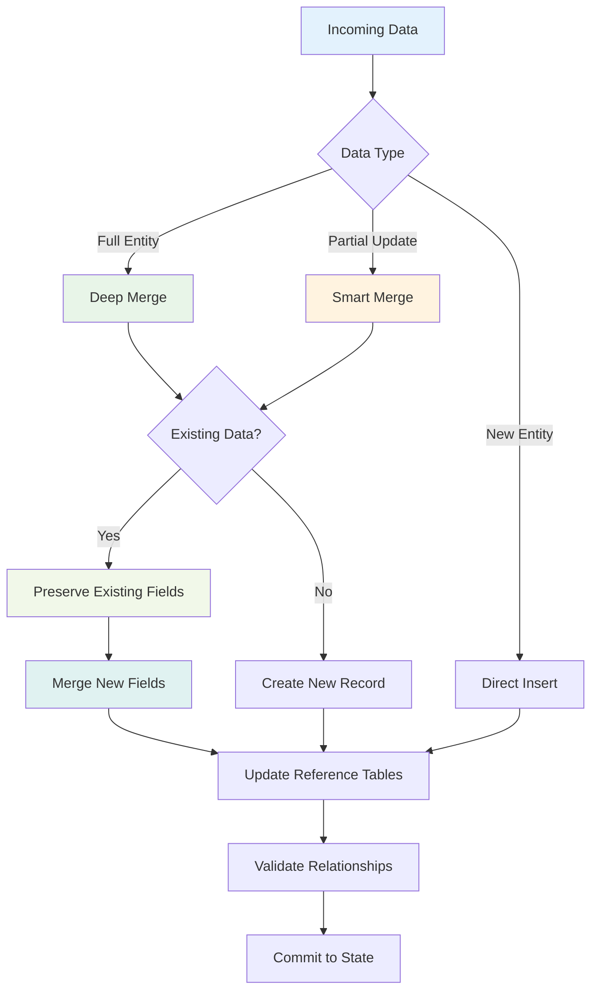
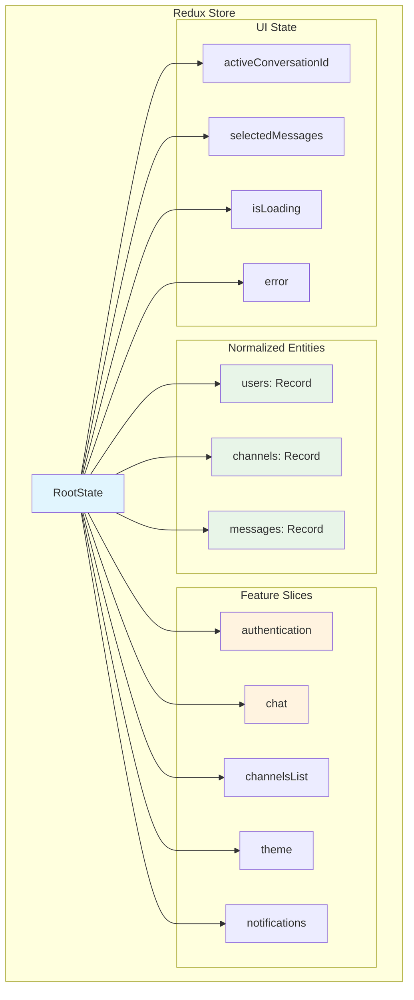
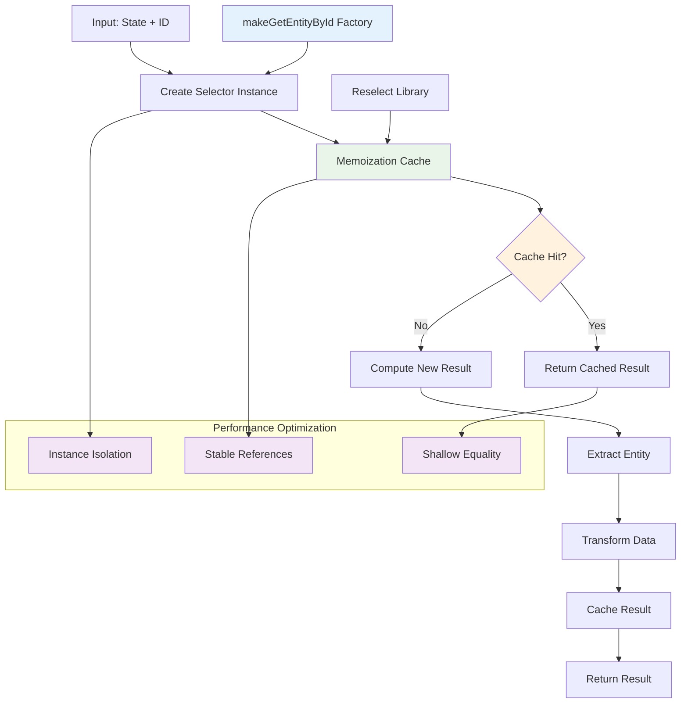
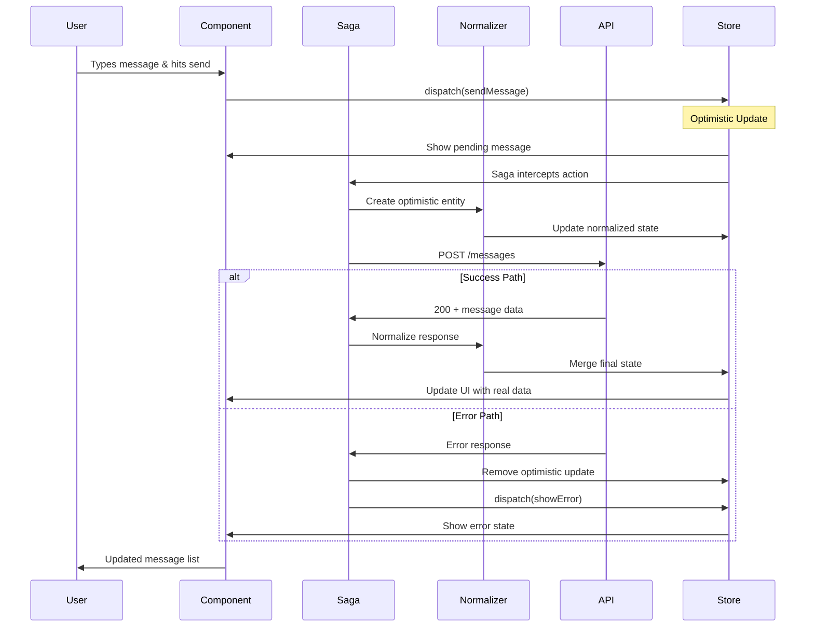
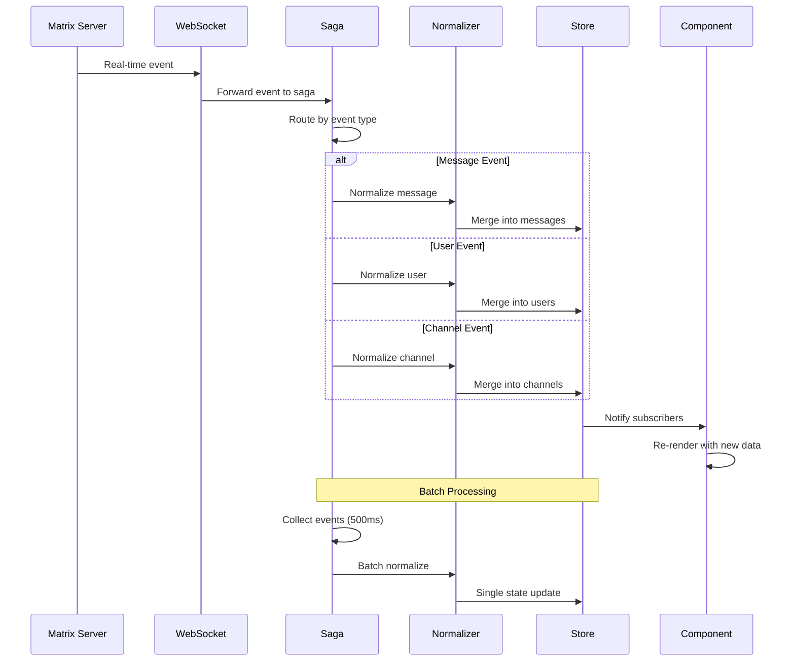
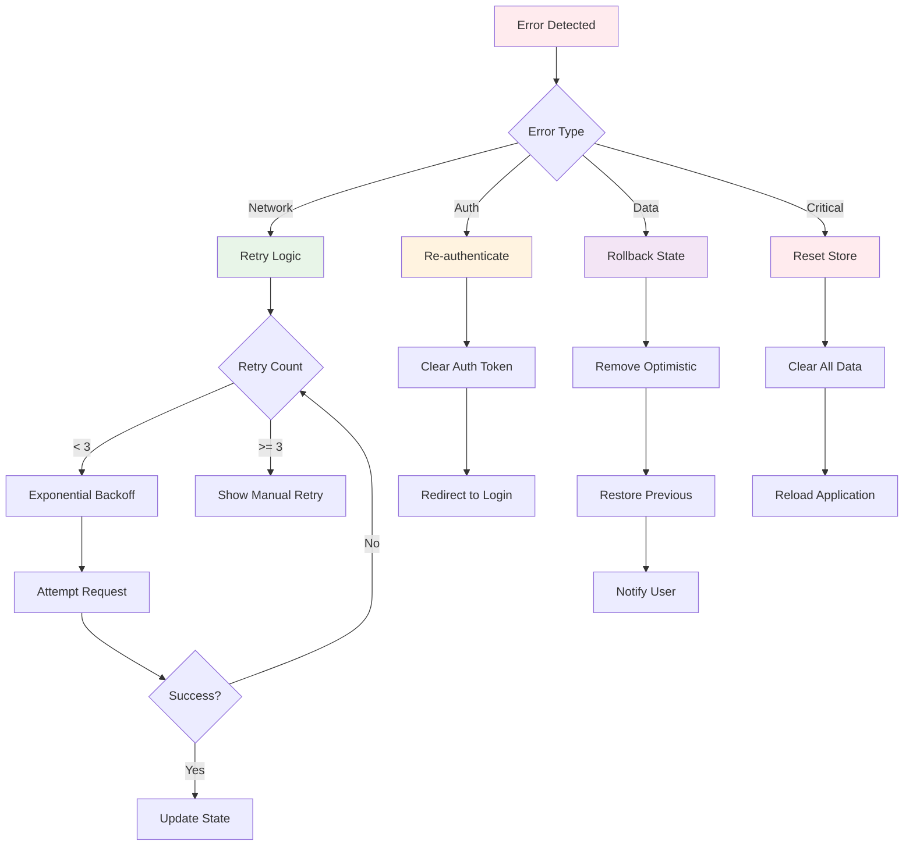

# Redux Galaxy Visual Guide

*"A picture is worth a thousand state updates, and a diagram is worth a million debugging sessions."*

This visual guide transforms the complex Redux-Saga flow, normalization patterns, and state architecture from Chapter 2: The Redux Galaxy into clear, understandable diagrams. Whether you're debugging a flow or learning the patterns, these visuals will be your cosmic map.

---

## Table of Contents

1. [Redux-Saga Flow Architecture](#redux-saga-flow-architecture)
2. [Normalization Engine Patterns](#normalization-engine-patterns)
3. [State Architecture Overview](#state-architecture-overview)
4. [Selector Constellation Patterns](#selector-constellation-patterns)
5. [Data Flow Sequences](#data-flow-sequences)
6. [Error Handling & Recovery](#error-handling--recovery)

---

## Redux-Saga Flow Architecture

### 1. Root Saga Orchestration

```ascii
┌─────────────────────────────────────────────────────────────────┐
│                        ROOT SAGA UNIVERSE                       │
│                                                                 │
│  ┌─────────────┐     ┌─────────────┐     ┌─────────────┐      │
│  │   Spawn     │────▶│    Spawn    │────▶│    Spawn    │      │
│  │ Page Load   │     │    Web3     │     │  Channels   │      │
│  └─────────────┘     └─────────────┘     └─────────────┘      │
│           │                  │                  │             │
│           ▼                  ▼                  ▼             │
│  ┌─────────────┐     ┌─────────────┐     ┌─────────────┐      │
│  │   Spawn     │     │   Spawn     │     │   Spawn     │      │
│  │ Messages    │     │ Auth Flow   │     │ Chat Events │      │
│  └─────────────┘     └─────────────┘     └─────────────┘      │
│           │                  │                  │             │
│           └──────────────────┼──────────────────┘             │
│                              │                                │
│                    ┌─────────▼─────────┐                      │
│                    │  Error Boundary   │                      │
│                    │ (Isolated Crash)  │                      │
│                    └───────────────────┘                      │
└─────────────────────────────────────────────────────────────────┘

Legend:
├─ spawn()  = Independent saga process
├─ ────▶    = Initialization flow
└─ Error    = Saga-level error isolation
```

### 2. Saga Lifecycle Patterns

```mermaid
graph TD
    A[Action Dispatched] --> B{Saga Watcher}
    B -->|takeLatest| C[Cancel Previous]
    B -->|takeEvery| D[Fork New Instance]
    B -->|takeLeading| E[Ignore if Running]
    
    C --> F[Execute Saga]
    D --> F
    E --> F
    
    F --> G{Side Effect}
    G -->|API Call| H[call()]
    G -->|State Update| I[put()]
    G -->|Data Select| J[select()]
    G -->|Delay| K[delay()]
    
    H --> L{Success?}
    L -->|Yes| M[Normalize Data]
    L -->|No| N[Error Handling]
    
    M --> O[Dispatch Success]
    N --> P[Dispatch Error]
    
    O --> Q[Update State]
    P --> Q
    
    style A fill:#e1f5fe
    style F fill:#f3e5f5
    style M fill:#e8f5e8
    style N fill:#ffebee
```

---

## Normalization Engine Patterns

### 1. The Unified Normalization Flow

```ascii
┌─────────────────────────────────────────────────────────────────┐
│                    NORMALIZATION UNIVERSE                       │
│                                                                 │
│  INPUT: Nested API Response                                     │
│  ┌─────────────────────────────────────────────────────┐       │
│  │ {                                                   │       │
│  │   channels: [{                                      │       │
│  │     id: "room1",                                    │       │
│  │     messages: [{                                    │       │
│  │       id: "msg1",                                   │       │
│  │       author: { id: "user1", name: "Alice" }       │       │
│  │     }]                                              │       │
│  │   }]                                                │       │
│  │ }                                                   │       │
│  └─────────────────────────────────────────────────────┘       │
│                              │                                 │
│                              ▼                                 │
│  ┌─────────────────────────────────────────────────────┐       │
│  │              NORMALIZER ENGINE                      │       │
│  │                                                     │       │
│  │  1. Schema Validation    ┌──────────────────┐      │       │
│  │     - Check __denormalized flag             │      │       │
│  │     - Prevent infinite loops                │      │       │
│  │                                             │      │       │
│  │  2. Entity Extraction    ┌──────────────────┐      │       │
│  │     - Flatten nested objects               │      │       │
│  │     - Create relationship tables          │      │       │
│  │                                             │      │       │
│  │  3. Reference Mapping    ┌──────────────────┐      │       │
│  │     - Generate entity IDs                  │      │       │
│  │     - Build lookup tables                 │      │       │
│  └─────────────────────────────────────────────────────┘       │
│                              │                                 │
│                              ▼                                 │
│  OUTPUT: Normalized State                                       │
│  ┌─────────────────────────────────────────────────────┐       │
│  │ entities: {                                         │       │
│  │   users: {                                          │       │
│  │     "user1": { id: "user1", name: "Alice" }        │       │
│  │   },                                                │       │
│  │   messages: {                                       │       │
│  │     "msg1": { id: "msg1", author: "user1" }        │       │
│  │   },                                                │       │
│  │   channels: {                                       │       │
│  │     "room1": { id: "room1", messages: ["msg1"] }   │       │
│  │   }                                                 │       │
│  │ }                                                   │       │
│  └─────────────────────────────────────────────────────┘       │
└─────────────────────────────────────────────────────────────────┘
```

### 2. Merge-First Update Strategy



### 3. Entity Relationship Diagram

```ascii
┌─────────────────────────────────────────────────────────────────┐
│                    NORMALIZED STATE SCHEMA                      │
│                                                                 │
│  ┌─────────────┐     ┌─────────────┐     ┌─────────────┐       │
│  │    USERS    │     │  CHANNELS   │     │  MESSAGES   │       │
│  │─────────────│     │─────────────│     │─────────────│       │
│  │ id: string  │◄────┤ id: string  │◄────┤ id: string  │       │
│  │ name: str   │     │ name: str   │     │ content: str│       │
│  │ avatar: str │     │ type: enum  │     │ author: ref │──────┐│
│  │ status: enum│     │ members: []ref     │ timestamp   │      ││
│  │ lastSeen: ts│     │ messages: []ref    │ parentId: ref      ││
│  └─────────────┘     │ unreadCount │     │ reactions: {}│      ││
│         ▲            │ labels: []  │     │ editedAt: ts│      ││
│         │            └─────────────┘     └─────────────┘      ││
│         │                   ▲                   │            ││
│         │                   │                   │            ││
│         └───────────────────┼───────────────────┘            ││
│                             │                                ││
│  ┌─────────────────────────────────────────────────────────────┘│
│  │                RELATIONSHIP TABLES                          │
│  │                                                             │
│  │  channelMembers: {                                          │
│  │    "room1": ["user1", "user2", "user3"]                    │
│  │  }                                                          │
│  │                                                             │
│  │  channelMessages: {                                         │
│  │    "room1": ["msg1", "msg2", "msg3"]                       │
│  │  }                                                          │
│  │                                                             │
│  │  messageReplies: {                                          │
│  │    "msg1": ["reply1", "reply2"]                            │
│  │  }                                                          │
│  └─────────────────────────────────────────────────────────────│
└─────────────────────────────────────────────────────────────────┘

Legend:
├─ ref      = Reference to another entity
├─ []ref    = Array of references
├─ ◄────    = One-to-many relationship
└─ {}       = Object/Map structure
```

---

## State Architecture Overview

### 1. Complete Redux Store Structure



### 2. Data Flow Architecture

```ascii
┌─────────────────────────────────────────────────────────────────┐
│                        DATA FLOW COSMOS                         │
│                                                                 │
│  ┌─────────────┐    ┌─────────────┐    ┌─────────────┐         │
│  │   UI LAYER  │    │ SAGA LAYER  │    │ API LAYER   │         │
│  │─────────────│    │─────────────│    │─────────────│         │
│  │ Components  │───▶│ Watchers    │───▶│ HTTP Calls  │         │
│  │ Hooks       │    │ Workers     │    │ WebSockets  │         │
│  │ Selectors   │◄───│ Effects     │◄───│ Responses   │         │
│  └─────────────┘    └─────────────┘    └─────────────┘         │
│          │                  │                  │               │
│          ▼                  ▼                  ▼               │
│  ┌─────────────┐    ┌─────────────┐    ┌─────────────┐         │
│  │   ACTIONS   │    │ NORMALIZER  │    │   CACHE     │         │
│  │─────────────│    │─────────────│    │─────────────│         │
│  │ User Events │───▶│ Schema Val. │───▶│ Entity Store│         │
│  │ API Events  │    │ Entity Ext. │    │ Relationships        │
│  │ System Evts │    │ Ref Mapping │    │ Indexes     │         │
│  └─────────────┘    └─────────────┘    └─────────────┘         │
│          │                  │                  │               │
│          └──────────────────┼──────────────────┘               │
│                             ▼                                  │
│                    ┌─────────────┐                             │
│                    │   REDUCER   │                             │
│                    │─────────────│                             │
│                    │ Merge Logic │                             │
│                    │ State Trees │                             │
│                    │ Immutability│                             │
│                    └─────────────┘                             │
│                             │                                  │
│                             ▼                                  │
│                    ┌─────────────┐                             │
│                    │   STORE     │                             │
│                    │─────────────│                             │
│                    │ Normalized  │                             │
│                    │ Subscriptions                            │
│                    │ DevTools    │                             │
│                    └─────────────┘                             │
└─────────────────────────────────────────────────────────────────┘

Flow Direction:
├─ ───▶  = Forward data flow
├─ ◄───  = Backward data flow
└─ ▼     = Vertical state flow
```

---

## Selector Constellation Patterns

### 1. Selector Factory Architecture



### 2. Complex Selector Composition

```ascii
┌─────────────────────────────────────────────────────────────────┐
│                    SELECTOR CONSTELLATION                       │
│                                                                 │
│  ┌─────────────┐     ┌─────────────┐     ┌─────────────┐       │
│  │   Basic     │     │  Composed   │     │  Complex    │       │
│  │ Selectors   │────▶│  Selectors  │────▶│ Selectors   │       │
│  │─────────────│     │─────────────│     │─────────────│       │
│  │ getUser     │     │ getUserBy   │     │ getChannel  │       │
│  │ getChannel  │     │ getChannel  │     │ WithMembers │       │
│  │ getMessage  │     │ WithAuthor  │     │ AndMessages │       │
│  └─────────────┘     └─────────────┘     └─────────────┘       │
│         │                     │                     │           │
│         ▼                     ▼                     ▼           │
│  ┌─────────────┐     ┌─────────────┐     ┌─────────────┐       │
│  │ createSel.  │     │ createSel.  │     │ createSel.  │       │
│  │ + Memo      │     │ + Memo      │     │ + Memo      │       │
│  │ + Instance  │     │ + Compose   │     │ + Deep Comp │       │
│  └─────────────┘     └─────────────┘     └─────────────┘       │
│         │                     │                     │           │
│         └─────────────────────┼─────────────────────┘           │
│                               ▼                                 │
│                     ┌─────────────┐                             │
│                     │   HOOKS     │                             │
│                     │─────────────│                             │
│                     │useSelector  │                             │
│                     │useCallback  │                             │
│                     │useMemo      │                             │
│                     └─────────────┘                             │
│                               │                                 │
│                               ▼                                 │
│                     ┌─────────────┐                             │
│                     │ COMPONENTS  │                             │
│                     │─────────────│                             │
│                     │ Re-render   │                             │
│                     │ Optimization│                             │
│                     │ Performance │                             │
│                     └─────────────┘                             │
└─────────────────────────────────────────────────────────────────┘

Performance Benefits:
├─ Memo Cache    = Results cached until inputs change
├─ Instance Iso. = Each component gets own cache
├─ Stable Refs   = Same input = same reference
└─ Compose Chain = Build complex from simple
```

---

## Data Flow Sequences

### 1. Message Send Sequence



### 2. Real-time Event Processing



---

## Error Handling & Recovery

### 1. Saga Error Boundaries

```ascii
┌─────────────────────────────────────────────────────────────────┐
│                    ERROR HANDLING COSMOS                        │
│                                                                 │
│  ┌─────────────────────────────────────────────────────┐       │
│  │                ROOT SAGA SPAWNER                    │       │
│  │                                                     │       │
│  │  spawn(sagaA) ───┐                                  │       │
│  │  spawn(sagaB) ───┼─── try/catch wrapper             │       │
│  │  spawn(sagaC) ───┘                                  │       │
│  │                                                     │       │
│  │  if (error) {                                       │       │
│  │    console.log(`Saga [${name}] failed`, error)     │       │
│  │    // Saga dies, others continue                    │       │
│  │  }                                                  │       │
│  └─────────────────────────────────────────────────────┘       │
│                              │                                 │
│                              ▼                                 │
│  ┌─────────────────────────────────────────────────────┐       │
│  │              INDIVIDUAL SAGA RECOVERY               │       │
│  │                                                     │       │
│  │  try {                                              │       │
│  │    yield call(apiFunction)                          │       │
│  │  } catch (error) {                                  │       │
│  │    if (error.status === 401) {                     │       │
│  │      yield put(logout())                           │       │
│  │    } else if (error.status >= 500) {               │       │
│  │      yield put(showRetryDialog())                  │       │
│  │    } else {                                         │       │
│  │      yield put(showErrorMessage(error))            │       │
│  │    }                                                │       │
│  │  }                                                  │       │
│  └─────────────────────────────────────────────────────┘       │
│                              │                                 │
│                              ▼                                 │
│  ┌─────────────────────────────────────────────────────┐       │
│  │              OPTIMISTIC UPDATE ROLLBACK             │       │
│  │                                                     │       │
│  │  1. Store optimistic ID mapping                     │       │
│  │  2. Apply optimistic state changes                  │       │
│  │  3. Show loading/pending UI                         │       │
│  │                                                     │       │
│  │  On Success:                                        │       │
│  │    - Replace optimistic with real data              │       │
│  │    - Update ID mappings                             │       │
│  │    - Clear loading states                           │       │
│  │                                                     │       │
│  │  On Failure:                                        │       │
│  │    - Remove optimistic entities                     │       │
│  │    - Restore previous state                         │       │
│  │    - Show error feedback                            │       │
│  └─────────────────────────────────────────────────────┘       │
└─────────────────────────────────────────────────────────────────┘
```

### 2. State Recovery Patterns



---

## Quick Reference: Visual Patterns

### ASCII Art Legend
```ascii
┌────┐ = Process/Component    ├─ = Connection point
│    │   boundary            └─ = Terminal connection
└────┘                       ── = Horizontal line
                              │  = Vertical line
───▶ = Data flow direction    ▼  = Downward flow
◄─── = Reverse flow          ▲  = Upward flow
┌─┐  = Small component       ●  = Decision point
```

### Mermaid Chart Types Used
- **Graph TD**: Top-down flow diagrams
- **sequenceDiagram**: Time-based interactions
- **Subgraphs**: Logical groupings
- **Styling**: Color-coded components

### Performance Indicators
- 🟢 **Green**: Optimized/cached operations
- 🟡 **Yellow**: Moderate performance impact
- 🔴 **Red**: Expensive operations
- 🔵 **Blue**: User interactions
- 🟣 **Purple**: System processes

---

*"In space, no one can hear you debug. But with these visual guides, every state update is observable, every selector is mapped, and every saga flow is charted through the Redux Galaxy."*

---

**Related**: [Chapter 2: Redux Galaxy](../chapters/02-redux-galaxy.md) | [Redux Workshops](../workshops/redux-galaxy-workshops.md)